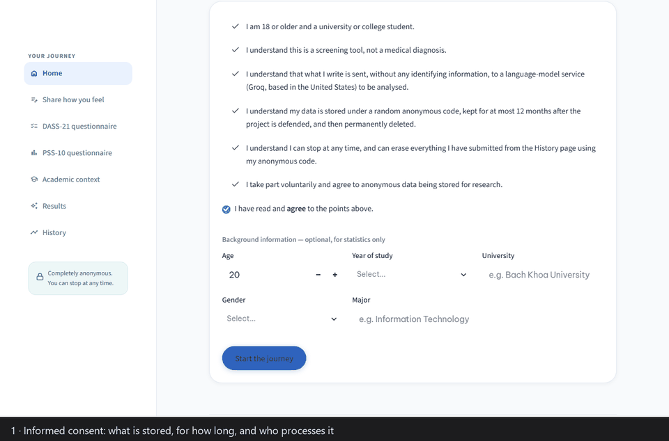

# Academic Stress Screening for Vietnamese University Students

A screening and self-reflection app that estimates a student's academic stress
from what they write and from two validated questionnaires (DASS-21, PSS-10),
explains the result with an LLM, and offers coping advice grounded in a curated
knowledge base. FastAPI · Streamlit · LangChain · ChromaDB · fine-tuned PhoBERT.



> ⚠️ **A screening aid, not a diagnostic tool.** Every result screen says so,
> and a deterministic safety gate replaces the normal result with Vietnamese
> mental-health helplines when self-harm risk is indicated.

## What it does

- **Measures with validated instruments first.** The headline level comes from
  DASS-21 and PSS-10, scored by their published rules. The LLM explains and
  advises; it never overrules a questionnaire, and when it reads the student's
  writing differently the app shows both.
- **Grounds every suggestion.** Advice may only restate retrieved passages;
  citations are checked against what was actually retrieved, and with nothing
  retrieved the app says so instead of inventing advice.
- **Puts a deterministic gate in front of everything.** A construct-based
  suicide-risk rule (English and Vietnamese) runs before anything is stored or
  sent to a provider.

## Results

All classification figures are on **synthetic** data (466 students generated
from 41 templates); they demonstrate the pipeline, not real-world accuracy.
Every number below is produced by a script and collected in
[docs/RESULTS.md](docs/RESULTS.md).

| What | Result | How it was measured |
|---|---|---|
| Crisis rule | **F1 0.929** (precision 1.000, recall 0.867); 0 false alarms on 20 lethal-sounding idioms | 60-item bilingual set, frozen with a hash *before* the rule was written |
| Retrieval | **MRR 0.844**, Recall@4 0.961 | 57 hand-labelled queries, in the exact form the deployed service sends |
| Grounding | **75 %** of suggestions fully supported by the retrieved passages, 99 % at least partially; without retrieval the model declines on 39 of 40 items | LLM judge from a different model family; a second-model check agrees at κ 0.81; human rating in progress |
| Classification | Full pipeline accuracy 0.671, **QWK 0.871, within one level on 100 % of items** — statistically indistinguishable from TF-IDF and fine-tuned PhoBERT | 70-item frozen test split, paired McNemar tests with Holm correction |
| Engineering | 412 tests, 93 % coverage of application code, CI | GitHub Actions on every push |

## What measuring it found

The evaluation changed the system more than once, and some of my own published
claims did not survive it:

- **My evaluation cache had been contaminated.** 85 stub entries written by a
  test were being served as model output — including every prediction behind a
  headline ablation result. I quarantined them, re-ran the affected studies,
  withdrew the conclusions they had supported, and added a guard that fails any
  test writing to the real cache.
- **The production retrieval query was discarding a third of its
  effectiveness.** A paired comparison showed the original query construction
  scoring MRR 0.509 against 0.839 for the rewrite, on the queries it affected.
- **"The full system clearly beats zero-shot" — withdrawn.** Its lead (13 items
  to 3) is significant on its own but not after the pre-specified correction for
  five comparisons (p = 0.085).
- **The LLM disagrees with the validated instrument on a third of cases, even
  with the scores in its prompt** — direct evidence for the design decision to
  let the questionnaire, not the model, decide the headline.
- **The first crisis rule caught almost no indirect ideation** (recall 0.20 on
  unseen phrasing). It was rebuilt around six clinical constructs and
  re-measured on a set frozen beforehand.

Each of these is written up, with the numbers it replaced, in
[docs/RESULTS.md](docs/RESULTS.md).

## Limitations

- **Synthetic data.** 34 of 70 test items are more than 0.80 similar to a
  training item; the classification figures measure template recognition. A
  consented real-data study is instrumented but not yet run.
- **The component ablation is inconclusive.** At n = 40 no component's removal
  is statistically distinguishable; resolving the two with a consistent
  direction would take roughly 100–150 paired items.
- **Single annotator.** The crisis and retrieval test sets were labelled by the
  author; the faithfulness judge awaits its human rating.

## Quick start

```powershell
pip install -r requirements.txt
copy .env.example .env         # set OPENAI_API_KEY - any OpenAI-compatible provider (Groq, Gemini, Ollama)
python scripts/seed.py --rows 200

python -m uvicorn app.api.main:app --port 8000          # terminal 1 - API, docs at /docs
python -m streamlit run streamlit_app/Home.py           # terminal 2 - UI at http://localhost:8501
```

Or `docker compose up --build`. The full operating guide, including warm-up
and troubleshooting, is [RUNBOOK.md](RUNBOOK.md).

Python 3.11+ (developed on 3.13), about 4 GB of disk for models. The local
PhoBERT classifier is expected at `models/phobert-stress`
(`research/phobert_finetune.py` reproduces it); without it the app falls back to
the lexicon, and it is only consulted for Vietnamese text in any case.

## Architecture

```
Streamlit UI (English, multipage)             FastAPI backend
┌───────────────────────────────┐   HTTP    ┌──────────────────────────────────┐
│ 1. Home / consent             │ ────────▶ │ POST /assess/text                │
│ 2. Share how you feel (text)  │           │ POST /assess/questionnaire       │
│ 3. DASS-21   4. PSS-10        │           │ POST /assess/full                │
│ 5. Academic context           │           │ GET  /history/{student_id}       │
│ 6. Results   7. History       │           │ DEL  /session/{student_id}       │
│                               │           │ GET  /health                     │
└───────────────────────────────┘           └───────┬──────────────────────────┘
                                                    │
        ┌───────────────┬───────────────┬───────────┼───────────────┐
        ▼               ▼               ▼           ▼               ▼
  Crisis rule     Scoring engines   NLP (PhoBERT   ChromaDB RAG   LangChain +
  (deterministic  (DASS-21/PSS-10,  stress clf +   (English       LLM provider
  gate: runs      ground truth)     bilingual      knowledge      (structured
  before any side                   lexicon)       base)          JSON output)
  effect)
                                        └──────── SQLite via SQLAlchemy ───────┘
```

The pipeline for `POST /assess/full`:

1. **NLP** — a fine-tuned PhoBERT stress classifier and a bilingual stress
   lexicon. PhoBERT is Vietnamese-only, so English text is scored by the lexicon
   alone, and the app labels which signal it used.
2. **Scoring** — DASS-21 and PSS-10 by their published rules produce the
   headline level (`Low / Moderate / High / Severe`).
3. **Crisis gate** — consumes the scores and the text. Everything before it is a
   pure function: nothing is stored and no provider is called until it clears.
   On a match the student sees helplines instead of a result, and the
   disclosure is never persisted.
4. **Retrieval** — top-k passages from the knowledge base (multilingual
   embeddings), with help-seeking passages pinned in for High or Severe results.
5. **LLM** — structured JSON: a level, confidence, reasoning, zero to five
   suggestions, risk flags and citations. Suggestions may not go beyond the
   retrieved material, and citations are verified against it.
6. **Persistence** — under an anonymous UUID; the prompt never contains
   identifying fields.

## Reproducing the experiments

Artifacts land in `data/eval/`; the tables are collected in
[docs/RESULTS.md](docs/RESULTS.md). LLM replies are disk-cached, so a re-run
after the first is free and deterministic.

```bash
python scripts/check_llm.py                       # pre-flight the provider and its daily quota

python -m app.eval.compare --dataset synthetic    # six systems on one frozen split
python scripts/comparison_paired.py               # paired McNemar re-analysis of that table
python -m app.eval.ablation --dataset synthetic --limit 40   # component ablation, paired tests
python -m app.eval.crisis_eval --testset data/eval/crisis_testset_heldout.jsonl \
                               --out data/eval/crisis_eval_heldout.md   # the held-out crisis set
python -m app.eval.retrieval_eval                 # retrieval quality, deployed query form first
python -m app.eval.faithfulness_eval --limit 40   # grounding of generated advice (LLM judge)
python scripts/phobert_checkpoint_compare.py      # the 4-class PhoBERT checkpoint vs the deployed one
python scripts/hub_experiment.py                  # the retrieval hub experiment
```

Every script takes a seed where randomness exists; the train/test split is
frozen in `data/stress_dataset_split.csv` and reused, so PhoBERT's training set
never leaks into test. For a real-data study: `scripts/export_dataset.py`,
`scripts/data_quality_report.py`, then `compare --dataset real`. Human rating:
`app.eval.export_for_rating`, `app.eval.rating_analysis`, and for the judge,
[docs/RATING_faithfulness.md](docs/RATING_faithfulness.md).

## Safety and privacy

- **Non-diagnostic** wording on every result surface, API responses included.
- **Crisis gate** before any side effect: six suicide-risk constructs in English
  and Vietnamese with span-local guards for idioms, plus DASS-21 risk items 17
  and 21. Helplines: Ngày Mai 096 306 1414, 111, 115.
- **Crisis disclosures are not retained** — only the reason the gate fired is
  logged, never the text.
- **Consent first.** The consent screen names the language-model provider
  (resolved from the configured endpoint), the retention period, and the right
  to erase.
- **Right to withdraw.** `DELETE /session/{student_id}` erases every row for an
  anonymous code, behind a two-step control on the History page.

## Repository layout

```
app/
  api/          FastAPI app and orchestration (services.py)
  scoring/      DASS-21 and PSS-10 engines, unified label
  nlp/          PhoBERT classifier, bilingual lexicon, crisis patterns
  rag/          ChromaDB store, Markdown ingestion, retriever
  llm/          LangChain chain with a Pydantic parser; the safety gate
  db/           SQLAlchemy models
  eval/         every evaluation harness
streamlit_app/  the English, multipage UI
data/knowledge/ the English knowledge base for retrieval
research/       dataset generator, TF-IDF baselines, PhoBERT fine-tuning
scripts/        seeding, pre-flight checks, re-analyses
report/latex/   the submitted report (HCMIU template) and its figure generators
docs/           RESULTS, RISKS, AUDIT, decisions and review sheets
tests/          pytest suite - no network or API key needed
```

Tests: `python -m pytest tests/ -q`.

## License

Code under the [MIT License](LICENSE). The DASS-21 (Lovibond & Lovibond, 1995)
and PSS-10 (Cohen et al., 1983) are reproduced in their original English wording
under their research-use terms; they are not covered by the MIT license.

Pre-thesis project, International University — VNU-HCM.
