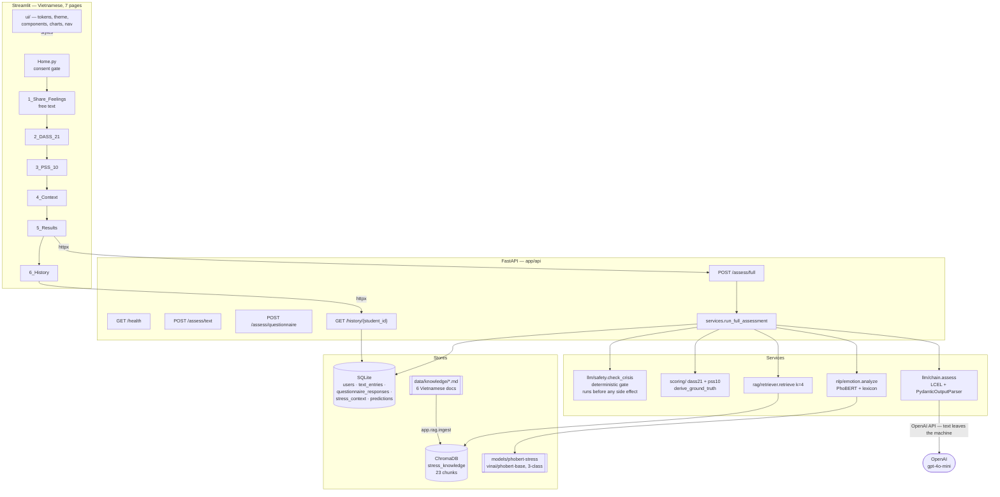

# Codebase Audit — Pre-Thesis

**Project:** An LLM-powered Application for Detecting Stress Levels in Vietnamese University Students
**Audited commit:** `50e145a` (plus an uncommitted UI redesign — see §1.4)
**Audit date:** 2026-08-03
**Method:** read-only inspection of every source file, plus five verification scripts run against the live repo (test suite, coverage, dataset statistics, near-duplicate leakage check, dependency reconciliation). No feature code was written in this step.

> **Re-verified 2026-09-08.** The suite, linter and evaluation harness were re-run against the working tree. Findings that have since been fixed are marked inline; the original wording is kept so the delta stays visible. Superseded items: the two undeclared dependencies (§1.6) are now declared, the test count is 277 not 198, and criteria 5, 6 and 8 in §4 have moved. Still open and unchanged: the missing `stress_dataset_clean.csv` build script, unpinned versions, `data/eval/` being gitignored, and crisis recall.

Every number in this document was produced by executing something in this repo. Where a claim could not be verified it is marked `[UNVERIFIED]`.

---

## 1. Inventory

### 1.1 Live application code — `app/` (25 files, ~1 670 statements)

| Path | LOC | Purpose | Status |
|---|---:|---|---|
| [app/config.py](../app/config.py) | 54 | pydantic-settings singleton; all paths/keys from env | live |
| [app/api/main.py](../app/api/main.py) | 188 | FastAPI app: 5 routes, lifespan `init_db()` | live |
| [app/api/services.py](../app/api/services.py) | 236 | Assessment orchestration (crisis→NLP→scoring→RAG→LLM→persist) | live |
| [app/scoring/dass21.py](../app/scoring/dass21.py) | 156 | DASS-21 items, cut-offs, scorer | live |
| [app/scoring/pss10.py](../app/scoring/pss10.py) | 100 | PSS-10 items, reverse scoring, scorer | live |
| [app/scoring/__init__.py](../app/scoring/__init__.py) | 61 | `derive_ground_truth()` — unified 4-class label | live |
| [app/nlp/emotion.py](../app/nlp/emotion.py) | 165 | PhoBERT stress inference, language detect, polarity | live |
| [app/nlp/lexicon.py](../app/nlp/lexicon.py) | 196 | 210-keyword bilingual stress lexicon (7 categories); `CRISIS_KEYWORDS` kept for provenance only | live |
| [app/nlp/crisis_patterns.py](../app/nlp/crisis_patterns.py) | 208 | Six suicide-risk constructs + span-local idiom guards — what `find_crisis_keywords()` actually runs | live |
| [app/llm/chain.py](../app/llm/chain.py) | 202 | LCEL chain `prompt \| llm \| PydanticOutputParser` | live |
| [app/llm/safety.py](../app/llm/safety.py) | 86 | Deterministic crisis rule + Vietnamese helpline text | live |
| [app/rag/store.py](../app/rag/store.py) | 67 | Chroma persistent client + embedding selection | live |
| [app/rag/ingest.py](../app/rag/ingest.py) | 112 | Markdown → heading chunks → Chroma upsert | live |
| [app/rag/retriever.py](../app/rag/retriever.py) | 50 | top-k query, never raises | live |
| [app/db/models.py](../app/db/models.py) | 162 | 5 ORM tables | live |
| [app/db/database.py](../app/db/database.py) | 55 | engine/session factory | live |
| [app/schemas/models.py](../app/schemas/models.py) | 206 | Pydantic v2 request/response contracts | live |
| [app/schemas/enums.py](../app/schemas/enums.py) | 50 | StressLevel, DassSeverity, … | live |
| [app/eval/datasets.py](../app/eval/datasets.py) | 108 | frozen-split loader (`synthetic` / `real`) | live (eval) |
| [app/eval/baselines.py](../app/eval/baselines.py) | 349 | 4 comparison systems + disk LLM cache | live (eval) |
| [app/eval/compare.py](../app/eval/compare.py) | 163 | comparison runner → `data/eval/comparison.*` | live (eval) |
| [app/eval/ablation.py](../app/eval/ablation.py) | 181 | 5-config ablation over the proposed system | live (eval) |
| [app/eval/crisis_eval.py](../app/eval/crisis_eval.py) | 171 | crisis-rule P/R/F1 vs. labelled test set | live (eval) |
| [app/eval/evaluate.py](../app/eval/evaluate.py) | 131 | metric computation + confusion-matrix plot | live (eval) |
| [app/eval/export_for_rating.py](../app/eval/export_for_rating.py) | 108 | human-rating sheet export | scaffold, no data |
| [app/eval/rating_analysis.py](../app/eval/rating_analysis.py) | 150 | Krippendorff's α over rating sheets | scaffold, no data |
| [app/eval/sus_score.py](../app/eval/sus_score.py) | 71 | SUS (Brooke) scorer | scaffold, no data |
| [app/eval/synthetic.py](../app/eval/synthetic.py) | 134 | simulated predictions — **pipeline self-test only** | test fixture |

### 1.2 Frontend — `streamlit_app/` (7 pages + `ui/` package)

`Home.py` (consent) → `1_Share_Feelings` (free text) → `2_DASS_21` → `3_PSS_10` → `4_Context` (context) → `5_Results` (results, 369 LOC) → `6_History` (history).
`ui/` is a new internal design-system package: `tokens.py` (102), `theme.py` (494, CSS), `components.py` (368), `charts.py` (207), `icons.py` (143), `nav.py` (57). `preview.py` (173) is a component gallery deliberately kept outside `pages/`.

### 1.3 Research scripts — `research/` (frozen, excluded from ruff)

`generate_dataset.py` (431) · `baseline.py` (149, creates the frozen split) · `phobert_finetune.py` (162) · `dass21_original.py` (168, superseded) · `emotion_en.py` (133, superseded, **dead code**).

### 1.4 Uncommitted work

8 modified files (+814/−376) and 7 untracked paths (`streamlit_app/ui/`, `streamlit_app/static/`, `streamlit_app/preview.py`, `design-system/`, `.streamlit/`, `tests/test_retriever.py`, `run.md`). **The entire UI redesign and its design-system documentation are outside version control.** This is the single largest uncommitted risk in the repo.

### 1.5 Entry points (verified against [Makefile](../Makefile))

```bash
uvicorn app.api.main:app --host 0.0.0.0 --port 8000   # API
streamlit run streamlit_app/Home.py              # UI
python -m app.rag.ingest                              # RAG ingestion (23 chunks)
python research/baseline.py --data data/stress_dataset_clean.csv   # creates the frozen split
python research/phobert_finetune.py --epochs 4 --batch-size 16     # fine-tune
python -m app.eval.compare --dataset synthetic        # baseline comparison
python -m app.eval.ablation --dataset synthetic       # ablation (needs a key)
python -m app.eval.crisis_eval                        # crisis-rule evaluation
python scripts/seed.py --rows 200                     # demo DB
```

### 1.6 Dependencies — reconciled against actual imports

- **Every requirement is unpinned** (`>=` only, 21 lines in [requirements.txt](../requirements.txt)). A committee that re-runs the repo in six months gets different library versions than the ones that produced the results.
- **Imported but undeclared (2, both load-bearing)** — *resolved 2026-09-08; both are now in `requirements.txt` with the failure each prevents recorded inline:*
  - `sentence-transformers` — required by [app/rag/store.py:32](../app/rag/store.py#L32); without it the multilingual embedder silently falls back to Chroma's English-leaning ONNX MiniLM (the `except` at line 37), degrading Vietnamese retrieval with only a log warning.
  - `tabulate` — required by every `df.to_markdown()` call ([compare.py:75](../app/eval/compare.py#L75), [ablation.py:159](../app/eval/ablation.py#L159)); its absence crashes the evaluation runners at the final step.
- **Declared but never imported:** `langchain-community` (unused), `openai` (transitive via `langchain-openai`), `uvicorn` (CLI), `pytest-asyncio` (used via `asyncio_mode = "auto"` config). Only `langchain-community` is genuinely dead weight.
- No secrets are committed: `.env` is untracked, `.env.example` is the only env file in git, `git log --all -p | grep 'sk-…'` finds nothing, and the local `.env` holds the literal 6-character placeholder `sk-...`. **Clean — no key rotation needed.** (Stale leftover: `.env` still sets `HF_SENTIMENT_MODEL`, a setting removed from `Settings`; harmless because of `extra="ignore"`.)

---

## 2. Architecture reconstructed from the code

### 2.1 Components



### 2.2 Primary user journey

```mermaid
sequenceDiagram
    participant S as Student
    participant UI as Streamlit
    participant API as FastAPI
    participant SF as check_crisis
    participant SC as scoring
    participant NL as PhoBERT+lexicon
    participant RG as Chroma
    participant LM as OpenAI
    participant DB as SQLite

    S->>UI: consent (Home.py)
    Note over UI: require_consent() gates every later page
    S->>UI: free text · DASS-21 · PSS-10 · context
    S->>UI: "Analyse now"
    UI->>API: POST /assess/full
    API->>NL: analyze(raw_text)
    NL-->>API: EmotionResult
    API->>DB: save_text_entry  ⚠ BEFORE the crisis check
    API->>SC: score_dass21 / score_pss10 → derive_ground_truth
    API->>DB: save_questionnaire, save_stress_context
    API->>SF: check_crisis(text, dass_answers, depression_severity)
    alt crisis fires
        SF-->>API: is_crisis=True
        API-->>UI: helplines only — no RAG, no LLM
        UI-->>S: crisis card; analysis suppressed
    else normal path
        API->>RG: retrieve(query, k=4)
        RG-->>API: 4 chunks (or [] on failure)
        API->>LM: prompt(text, emotion, scores, context, docs)
        LM-->>API: LlmAssessment (level, confidence, reasoning, 3 suggestions, flags)
        Note over API: on LLM failure → deterministic results only
        API->>DB: Prediction row
        API-->>UI: full response
        UI-->>S: level, gauge, subscales, reasoning, 3 suggestions, sources
    end
```

### 2.3 Data model and retention

Five tables ([app/db/models.py](../app/db/models.py)), SQLite at `data/stress_app.db`, all primary keys UUID4 generated app-side:

| Table | Contents | Retention |
|---|---|---|
| `users` | `student_id` (UUID), age, gender, year_of_study, major, university | **indefinite** |
| `text_entries` | **`raw_text` in plaintext**, length, language, emotion label/scores, keywords | **indefinite** |
| `questionnaire_responses` | all 21 DASS + 10 PSS raw items, derived scores and severities | **indefinite** |
| `stress_context` | 14 lifestyle/academic/coping fields | **indefinite** |
| `predictions` | ground-truth label, LLM label, confidence, retrieved-chunk ids, LLM explanation | **indefinite** |

**What survives the browser closing:** everything above. The Streamlit session keeps `student_id` only in `st.session_state`, so a student who closes the tab loses the *link* to their rows but the rows persist server-side forever. There is no expiry job, no encryption at rest, and no delete path (§5.4).

---

## 3. Deep-dive: the four critical subsystems

### A. Psychometric scoring — **correct arithmetic, weak provenance**

**DASS-21** ([app/scoring/dass21.py](../app/scoring/dass21.py)) is implemented exactly per Lovibond & Lovibond (1995). Verified against the published manual:

| Subscale | Items (7 each, verified) | Normal | Mild | Moderate | Severe | Ext. Severe |
|---|---|---|---|---|---|---|
| Depression | 3,5,10,13,16,17,21 | 0–9 | 10–13 | 14–20 | 21–27 | 28+ |
| Anxiety | 2,4,7,9,15,19,20 | 0–7 | 8–9 | 10–14 | 15–19 | 20+ |
| Stress | 1,6,8,11,12,14,18 | 0–14 | 15–18 | 19–25 | 26–33 | 34+ |

Cut-offs at [dass21.py:25–47](../app/scoring/dass21.py#L25-L47), ×2 multiplier at [dass21.py:150](../app/scoring/dass21.py#L150). **No deviation from the manual.** Input validation rejects anything but exactly ids 1–21 with values 0–3 ([dass21.py:94–105](../app/scoring/dass21.py#L94-L105)), including a `bool` guard.

**PSS-10** ([app/scoring/pss10.py](../app/scoring/pss10.py)): reverse items {4,5,7,8} at line 13, `4 − value` at line 91, bands 0–13 / 14–26 / 27–40 at lines 16–20. Arithmetic correct.

Two provenance problems the committee will find:

1. **The PSS-10 docstring calls these bands "Cohen's official PSS-10 scoring" ([pss10.py:3–5](../app/scoring/pss10.py#L3-L5)). Cohen never published clinical cut-offs** — he published normative means. The 0–13/14–26/27–40 split is a widely-used convention, not an official threshold. The word "official" must be removed from the code and must never reach the report.
2. **Neither Vietnamese item set is a verified validated translation.** `dass21.py:8–10` cites "the validated Vietnamese adaptation (Tran et al., 2013, BMC Psychiatry) **with minor smoothing for a student audience**" — i.e. by construction it is *not* the validated instrument, and the deviation is undocumented. `pss10.py` carries **no citation at all** for its Vietnamese wording. Both citations are `[UNVERIFIED]` — no PDF, DOI, or item-by-item diff exists in the repo.

**Unified label** ([app/scoring/__init__.py:28–51](../app/scoring/__init__.py#L28-L51)): `max(DASS-stress → {Normal→Low, Mild/Moderate→Moderate, Severe→High, ExtSevere→Severe}, PSS → identity)`. Defensible (screening favours sensitivity) and documented in [DECISIONS.md](../DECISIONS.md), but it is a **project-invented composite with no psychometric validation** — no published instrument produces this 4-class scale.

### B. PhoBERT classifier — **honest, small, and trained on template text**

| Property | Value | Evidence |
|---|---|---|
| Checkpoint | `vinai/phobert-base` (not large) | [phobert_finetune.py:32](../research/phobert_finetune.py#L32) |
| Head | `RobertaForSequenceClassification`, 3 labels | `models/phobert-stress/config.json` |
| Labels | positional `["Low","Moderate","High"]` | `LABELS` at finetune:30, `_PHOBERT_STRESS_LABELS` at [emotion.py:33](../app/nlp/emotion.py#L33) |
| Training data | 326 rows of **template-generated synthetic Vietnamese** | `_generate_free_text` at [generate_dataset.py:320](../research/generate_dataset.py#L320) |
| Split | frozen stratified 326/70/70, seed 42 | [baseline.py:39–55](../research/baseline.py#L39-L55) |
| Loss | class-weighted cross-entropy | [phobert_finetune.py:117–119](../research/phobert_finetune.py#L117-L119) |
| Optimiser | AdamW, lr 2e-5, wd 0.01, linear warmup 10 %, 4 epochs, grad-clip 1.0 | finetune:121–123 |
| Reported result | **val macro-F1 0.8403, test acc 0.800 / macro-F1 0.8013** (3-class) | `phobert_run.log` — a real captured run |

**Data provenance is the weak point, and it is worse than "synthetic".** The free text is assembled from a fixed bank of **41 sentence fragments** with slot-filling ([generate_dataset.py:108–178](../research/generate_dataset.py#L108-L178)). I measured the consequence:

> **Near-duplicate leakage (computed):** for each of the 70 test texts, the maximum `difflib` similarity to any training text is **median 0.808, p90 0.899, max 0.924**. **36/70 test items (51 %) are ≥ 0.80 similar to a training item; 6/70 are ≥ 0.90.** *(Superseded 2026-09-09: this measurement was recorded as "difflib similarity" without the details that change its output — comparison pool, `autojunk`, normalisation — and no variant reproduces these exact figures. `scripts/check_leakage.py` now pins the method and reports median 0.799, p90 0.893, max 0.907, 34/70 ≥ 0.80, under three measures. The conclusion is unchanged; only its provenance is now checkable.)* Exact-duplicate leakage is zero (466 distinct texts, 0 crossing splits) — but exact-match checking is the wrong instrument for template data.

So the split is *technically* clean and *substantively* leaky. Every text-classification number in this project is measuring template memorisation, not stress detection. The repo already says the numbers are synthetic; it does not yet say they are near-duplicated, and that is the sharper criticism.

**Word segmentation:** PhoBERT was pre-trained on VnCoreNLP-segmented text. This project feeds **raw unsegmented text at both training and inference** — training at [phobert_finetune.py:8–12](../research/phobert_finetune.py#L8-L12) (explicitly acknowledged in the docstring), inference at [emotion.py:67–73](../app/nlp/emotion.py#L67-L73). Because the mismatch is *consistent* across both, it does not silently destroy accuracy the way a train/inference mismatch would — it uniformly under-uses the checkpoint. This is a genuine, cheap ablation waiting to be run.

**Reproducibility gap:** `research/baseline.py` reads `data/stress_dataset_clean.csv` (466 rows, 11 columns), but that file is produced from `data/stress_dataset.csv` (500 rows, 75 columns) by **a script that does not exist in the repo**. I verified the raw file has exactly 466 unique `free_text` values, so the transform was an exact-dedup plus a column rename/projection — but that is reconstruction, not documentation. The chain "generator → clean → split → fine-tune" has a missing link. `max_length` also differs between training (160, finetune:87) and inference (256, emotion.py:72); harmless here, but it is an undocumented inconsistency.

Metrics are **not** hardcoded anywhere — `phobert_run.log` is a captured run and `app/eval/*` recomputes everything.

### C. RAG pipeline — **built, wired, and completely unevaluated**

| Aspect | Implementation | Verified |
|---|---|---|
| Corpus | 6 Vietnamese Markdown docs, hand-written for this project | `data/knowledge/*.md`, 2.1–3.4 KB each |
| Chunking | split on `##` headings, title prepended, >1500 chars re-split on paragraphs | [ingest.py:33–76](../app/rag/ingest.py#L33-L76) |
| Chunk count | **23 chunks, mean 553 characters** | computed; Chroma `embeddings` table = 23 |
| Embedder | `paraphrase-multilingual-MiniLM-L12-v2`, cosine HNSW | [store.py:21,57](../app/rag/store.py#L21) |
| Fallback | Chroma default ONNX MiniLM (English-leaning) on any exception | [store.py:37–41](../app/rag/store.py#L37-L41) |
| top-k | 4, fixed | [services.py:200](../app/api/services.py#L200) |
| Similarity threshold | **none** | `retrieve()` returns whatever comes back |
| Reranking | **none** | — |
| Grounding constraint | **soft only** | see below |
| Citation mechanism | **none at claim level** | `rag_sources` is a flat list on the response |
| Retrieval failure | returns `[]`, logs, **LLM still answers** | [retriever.py:48–50](../app/rag/retriever.py#L48-L50) |

**Corpus credibility.** All six documents were written by the project author. They are sensible and clearly domain-informed, but they are **not sourced, not licensed, and not citable** — no references, no author, no review. Helpline numbers (Ngày Mai 096 306 1414, 111, 115) are publicly listed and correct as written, but nothing in the repo records when they were last checked. For a mental-health RAG corpus, "the student wrote it" is the answer a committee will not accept without a provenance table.

**The grounding constraint does not exist.** The system prompt's strongest instruction about the retrieved documents is rule 3: *"grounded in the reference material provided"* ([chain.py:40–42](../app/llm/chain.py#L40-L42)). That is a preference, not a restriction. There is no "answer ONLY from the provided context", no refusal instruction when context is empty, and no per-claim citation field in `LlmAssessment` ([schemas/models.py:174–181](../app/schemas/models.py#L174-L181)). Combined with the silent `[]` on retrieval failure, **the system can and will emit confident mental-health advice with zero retrieved support, and the UI will still print "Reference material:" from a list that reflects retrieval, not usage** ([5_Results.py:362–363](../streamlit_app/pages/5_Results.py#L362-L363)).

**Zero retrieval evaluation exists.** No query set, no Recall@k, no MRR, no nDCG, no faithfulness judging, no k-sweep. For a thesis titled "LLM-powered", this is the largest scientific hole in the project.

### D. Safety & privacy — **strong deterministic core, real gaps around it**

**Crisis detection exists, runs before the LLM, and has been honestly measured.**

- Triggers ([safety.py:48–86](../app/llm/safety.py#L48-L86)): 14 explicit Vietnamese self-harm phrases (substring match, [lexicon.py:66–71](../app/nlp/lexicon.py#L66-L71)); OR DASS items 17 **and** 21 both = 3; OR Extremely-Severe depression with either risk item ≥ 2.
- When it fires: RAG and the LLM are skipped entirely ([services.py:189–197](../app/api/services.py#L189-L197)); the UI shows helplines and `st.stop()`s before rendering any analysis ([5_Results.py:201–209](../streamlit_app/pages/5_Results.py#L201-L209)).
- Measured on a 50-item hand-labelled held-out set the rule was **not** tuned against: **precision 0.800, recall 0.500, F1 0.615** (`data/eval/crisis_eval.md`). Explicit phrasing 10/10; **indirect ideation 1/9**; 3 false positives on hyperbole ("Mệt muốn chết" — "dead tired").

That measurement is the project's best piece of scientific honesty — and also its most serious safety finding. **A screening tool for students misses half of the self-harm signals in its own test set, and misses 8 of 9 indirect expressions.** In a domain where false negatives are the harmful error, precision 0.80 / recall 0.50 is the wrong trade-off. The report must state this plainly; the system should arguably widen the lexicon and accept more false positives.

**Disclaimers: present and unavoidable.** Shown on the home page before any input ([Home.py:68–73](../streamlit_app/Home.py#L68-L73)), in the consent checklist, on every result ([utils.py:15–19](../streamlit_app/utils.py#L15-L19)), in every API response (`AssessmentResponse.disclaimer`), and in the FastAPI app description. The LLM is explicitly forbidden from diagnostic language ([chain.py:34–36](../app/llm/chain.py#L34-L36)). **This is done properly.**

**Consent: the document is good, the app screen is not.** [docs/consent_form_vi.md](consent_form_vi.md) covers purpose, non-diagnosis, data collected, OpenAI transmission, and rights. The **in-app** consent form ([Home.py:78–82](../streamlit_app/Home.py#L78-L82)) reduces this to three bullets: age ≥ 18, screening-not-diagnosis, voluntary + anonymous storage. It **does not state that free text is sent to OpenAI**, does not state a retention period, and does not offer deletion. The app therefore collects mental-health free text under materially thinner consent than the study document promises. This is the highest-priority ethics fix in the repo.

**Privacy gaps, all verified:**

1. **Free text is persisted before the crisis check.** `save_text_entry` runs at [main.py:72](../app/api/main.py#L72) and [services.py:168](../app/api/services.py#L168); `check_crisis` runs after (main.py:74, services.py:184). Crisis-disclosing text is stored in plaintext — the opposite of "log the event without storing raw text".
2. **No deletion path.** The API exposes only `GET /health`, `POST /assess/text|questionnaire|full`, `GET /history/{id}` — no `DELETE`, no UI action, no retention job.
3. **No encryption at rest.** Plain SQLite file ([database.py:29](../app/db/database.py#L29)).
4. **`GET /history/{student_id}` is unauthenticated and returns `raw_text`** ([main.py:129–188](../app/api/main.py#L129-L188)). UUID4 makes this practically unguessable, but there is no authorisation layer at all — anyone holding or logging a UUID reads that person's journal.
5. **Quasi-identifiers are collected and stored** — age, gender, year, major, university ([Home.py:99–107](../streamlit_app/Home.py#L99-L107), `users` table). For a single institution this combination is re-identifying for small majors. The research export correctly strips them ([DECISIONS.md](../DECISIONS.md), Phase 4), but the live DB retains them.
6. **`.streamlit/config.toml` sets `showErrorDetails = true`** — stack traces reach the participant's browser.

**Secrets: clean.** No key in the repo, none in git history, `.env` untracked and holding a placeholder. Nothing to rotate.

---

## 4. Gap analysis against pre-thesis grading criteria

| # | Criterion | Score | Justification |
|---|---|:---:|---|
| 1 | Problem framing | **3/5** | The system embodies a coherent problem, but nothing in the repo *states* it: no problem statement, no objectives O1–O5, no scope document. README describes the artefact, not the research question. |
| 2 | Related-work grounding | **1/5** | Essentially absent. The only citations anywhere are Lovibond & Lovibond (1995) and "Tran et al., 2013" in docstrings and `data/knowledge/05_dass_pss_scales.md` — both `[UNVERIFIED]`. No literature review, no comparative table, no research-gap statement. |
| 3 | Methodological soundness | **3/5** | Pipeline design is sound and each decision is logged in [DECISIONS.md](../DECISIONS.md) — genuinely above average. Undercut by: a project-invented 4-class composite label with no validation, template-derived training data, and no reconciliation rule when the LLM contradicts the validated instrument (§5.1). |
| 4 | Experimental rigour | **2/5** | Two baselines actually ran (`tfidf_lr`, `phobert_ft`); two are wired but produced no numbers (no API key). Ablation harness exists, has never run. **Single seed. No majority-class baseline in the 4-class harness, no SVM, no few-shot, no XLM-R. No confidence intervals, no McNemar, no significance testing anywhere.** |
| 5 | Implementation quality | **4/5** | 337 tests, all passing (2026-09-10; was 198); 94 % coverage on `app/` excluding the offline evaluation tooling, 70 % including it; clean layering; graceful degradation at every external boundary; CI with ruff + pytest; Docker + compose. Deductions: unpinned deps, two undeclared runtime deps, the whole UI redesign uncommitted. |
| 6 | Evaluation of the LLM/RAG layer | **1/5 → 3/5** (2026-09-08) | *Originally: "Nothing."* Since then: retrieval is measured over 57 labelled queries (MRR 0.787, Recall@5 0.903) with a paired experiment showing the old query construction cost 0.33 MRR; the zero-shot LLM baseline has run; and every deterministic stage is now timed (`latency.md`). Still missing: faithfulness/groundedness judging, an LLM red-team suite, token/cost accounting, and the ablation — all blocked on provider quota rather than on code. |
| 7 | Safety & ethics | **3/5** | Deterministic pre-LLM crisis gate, unavoidable disclaimers, anonymous UUIDs, honest measurement of the rule's own failure — all strong. Offset by recall 0.50, in-app consent that omits third-party transmission, no deletion, no encryption, no `docs/ETHICS.md`. |
| 8 | Reproducibility | **3/5** | Frozen split, seeded generator, deterministic LLM caching, idempotent ingestion, exact evaluated dataframe written on every run — all good practice. Broken by: **the missing `stress_dataset_clean.csv` build script**, unpinned versions, and `data/eval/` being gitignored so no result artefact is under version control. *Improved 2026-09-08: the evaluation harness now retrieves through the production `build_rag_query()` — it previously used its own query shape, which returned a different top-4 chunk set on 53 % of items, so the proposed system was scored on a retrieval path the app never runs. Unparseable replies are also retained and classified now, rather than counted and discarded.* |
| 9 | UI/UX | **4/5** | 7-page Vietnamese flow, correct diacritics, consent gating on every page, a documented design system with **measured** contrast ratios ([tokens.py:20–24](../streamlit_app/ui/tokens.py#L20-L24)), colour never the sole carrier of meaning, results page deliberately never leads with a number. Missing: PDF export, "load sample session" demo button, and the work is uncommitted. |
| 10 | Documentation | **4/5** | README, DECISIONS.md (207 lines of rationale), RESULTS.md with explicit NOT-RUN markers, data dictionary, consent form, participant instructions, SUS questionnaire, design system. Missing: the audit/report layer itself, data card, ethics, limitations, reproducibility. |

**Mean: 2.8 / 5.** The engineering is markedly stronger than the science. A committee grades the science.

### What P2/P3/P4 asked for that does not exist yet

`results/` · `figures/` · `experiments/run_all.py` · `results/MANIFEST.json` · `report/` · `docs/DATA_CARD.md` · `docs/ETHICS.md` · `docs/LIMITATIONS.md` · `docs/REPRODUCIBILITY.md` · `docs/TODO_EXPERIMENTS.md` · `scripts/build_splits.py` · `scripts/bootstrap_ci.py` · `CLAUDE.md` (the P0 context block was never saved).

Note that current evidence lives in `data/eval/`, which `.gitignore` excludes (except `crisis_testset.jsonl`). P3's rule — every reported number traces to a versioned file — cannot currently be satisfied.

---

## 5. Cross-cutting findings not covered above

### 5.1 The LLM silently overrides the validated instrument

[5_Results.py:215–221](../streamlit_app/pages/5_Results.py#L215-L221):

```python
if assessment:
    level = assessment["predicted_level"]      # LLM wins
elif questionnaire:
    level = questionnaire["ground_truth_label"]  # only if the LLM failed
```

The headline stress level shown to the student is the **LLM's** judgement whenever the LLM is reachable. The DASS-21/PSS-10 result — the only psychometrically validated signal in the system — becomes a fallback. There is no disagreement detection, no reconciliation rule, and no indication to the student when the two differ. The prompt asks the model to weigh all evidence and lower its confidence on conflict ([chain.py:46–48](../app/llm/chain.py#L46-L48)), but nothing enforces or measures that. **For a screening tool this is the most consequential design decision in the codebase, and it is currently undocumented.**

### 5.2 Docker "runs offline for the committee" is not quite true

The Dockerfile copies `data/knowledge/` but **never runs `python -m app.rag.ingest`**, and the compose file mounts a named volume for `/srv/data`. A fresh `docker compose up` therefore starts with an empty Chroma collection; `retrieve()` logs a warning and returns `[]` ([retriever.py:31–33](../app/rag/retriever.py#L31-L33)), and the LLM answers ungrounded — silently. `models/` is bind-mounted read-only, so a committee machine without the 540 MB checkpoint also loses the PhoBERT signal, again silently.

### 5.3 Stale references

`research/generate_dataset.py:9,98` and `data/data_dictionary.md:4` point at `app/emotion.py` / `app/generate_dataset.py`, paths that no longer exist. `research/emotion_en.py` is dead code. Minor, but a reviewer who follows a link and hits nothing discounts everything else.

### 5.4 What is genuinely excellent and should be protected

Worth stating plainly, because the fix list below is long: the **discipline around not fabricating numbers is exceptional**. `comparison.md` prints "Not run — OPENAI_API_KEY missing" instead of a plausible number. `ablation.md` is a NOT-RUN marker file. `RESULTS.md` quarantines the simulated-agreement self-check in an appendix with a do-not-cite warning. `export_for_rating` *refuses* to export synthetic placeholder text so no human-eval number can rest on fake output. The crisis rule was measured and **not** tuned against its test set. Most pre-thesis repos fail exactly here. Do not let the upgrade phase erode it.

---

## 6. The five highest-leverage fixes, ranked by grade impact ÷ effort

**1 — Set the OpenAI key and run the two evaluations that are already written.** Effort: **XS** (one env var, two commands, responses disk-cache so it costs cents). Impact: **H**. `python -m app.eval.compare --dataset synthetic` fills the two empty rows; `python -m app.eval.ablation --dataset synthetic` produces a five-configuration table plus a computed interpretation paragraph and a figure. This converts criterion 4 from 2/5 to ~3.5/5 by executing code that already exists and is already tested. Nothing else in this list has a comparable ratio.

**2 — Evaluate the RAG layer.** Effort: **M** (~50 Vietnamese query→chunk pairs over 23 chunks, plus an LLM-as-judge faithfulness pass on ≥50 answers with a 20-item human-labelled subset). Impact: **H**. Criterion 6 is currently 1/5 and it is the criterion the thesis title promises. Recall@k / MRR / nDCG@5 over a 23-chunk corpus is a genuinely small job. Ship the k∈{1,3,5,8} sweep in the same script.

**3 — Fix consent, deletion, and crisis-text handling.** Effort: **S**. Impact: **H**. Add third-party-transmission, retention period, and deletion to the in-app consent bullets; move `save_text_entry` *after* `check_crisis` (or store a hash on crisis); add `DELETE /session/{student_id}` plus a UI button. Three small changes that close the gap between what [docs/consent_form_vi.md](consent_form_vi.md) promises and what the app does — and remove an ethics question the committee is guaranteed to ask.

**4 — Report the near-duplicate leakage instead of waiting to be caught by it.** *Done 2026-09-09: [scripts/check_leakage.py](../scripts/check_leakage.py) writes `data/eval/leakage.md`.* Effort: **S**. Impact: **H**. The measured numbers — median 0.799, 34/70 test items ≥0.80 similar to a training item — turn the project's most attackable weakness into evidence of methodological self-awareness. Pair it with the honest sentence: these classification numbers measure template memorisation, which is exactly why the real-data pipeline exists.

**5 — Commit the UI work and pin the dependencies.** Effort: **XS**. Impact: **M**. 814 lines of design-system work, the entire `ui/` package, and `design-system/MASTER.md` exist only on this disk. Commit them, add `sentence-transformers` and `tabulate` to requirements, and pin every version with `pip freeze`. Also un-gitignore `data/eval/*.md|csv|json` (or redirect them to `results/`) so reported numbers live under version control, as P3 requires.

**Deliberately below the line:** more baselines (SVM, few-shot, XLM-R) and multi-seed ± std. Both are real gaps, but each buys less per hour than the five above — and running three seeds over near-duplicated template data mostly buys precise error bars around a number that is not measuring the right thing. Fix the data story first.

---

*Companion documents:* [FEATURE_MATRIX.md](FEATURE_MATRIX.md) · [RISKS.md](RISKS.md)
