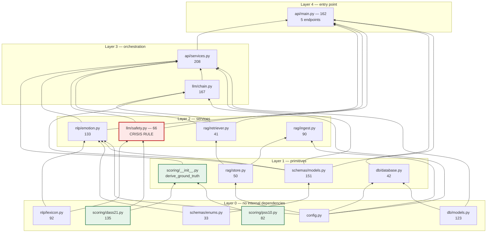
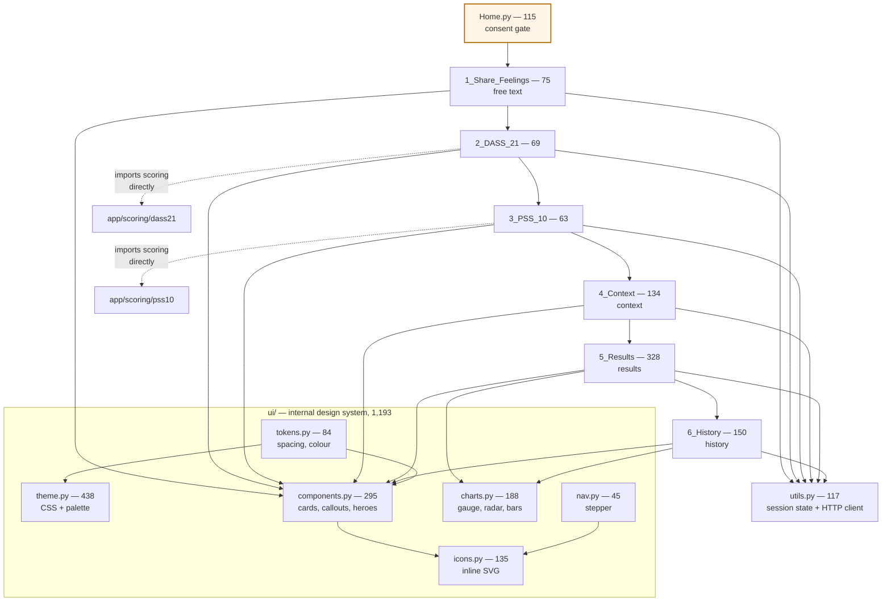
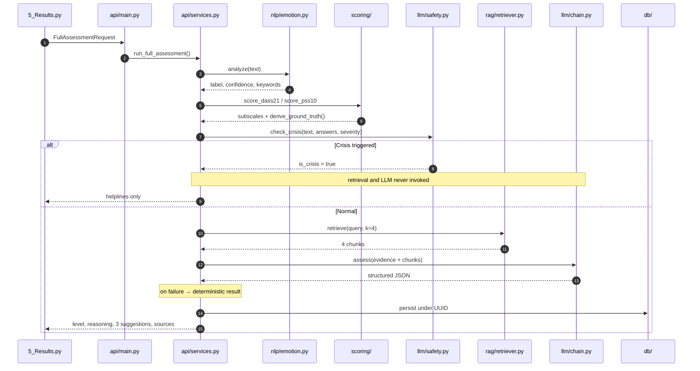
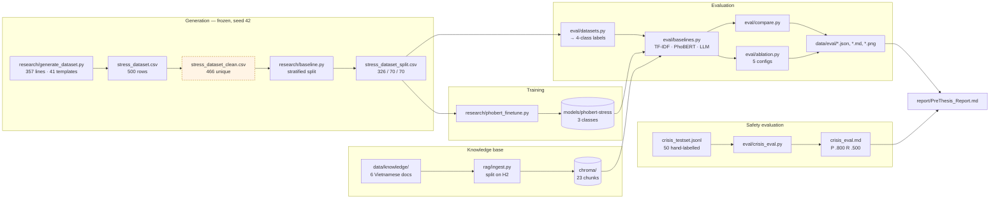
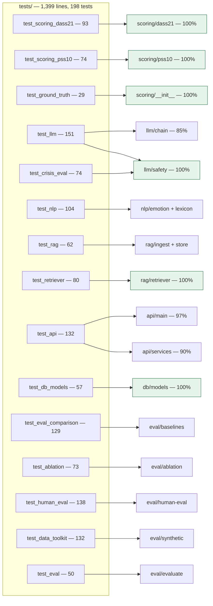

# Project Structure

Generated from the actual source: line counts are non-blank lines, and every edge in the dependency graphs below is a real `import` statement extracted by AST parsing — not a description of intent.

> **Preview note.** GitHub renders these diagrams natively. In VS Code, the built-in Markdown preview needs the *Markdown Preview Mermaid Support* extension; without it the diagrams show as code blocks.

**Total: 7,956 lines across 78 Python files.**

| Package | Lines | Share | Role |
|---|---:|---:|---|
| `app/` | 3,034 | 38 % | Backend: scoring, NLP, LLM, RAG, API, persistence, evaluation |
| `streamlit_app/` | 2,397 | 30 % | Vietnamese frontend + internal design system |
| `tests/` | 1,399 | 18 % | 198 tests, 83 % coverage of `app/` |
| `research/` | 855 | 11 % | Frozen: dataset generation, splits, fine-tuning |
| `scripts/` | 271 | 3 % | Operational: seeding, export, quality reporting |

---

## 1. Repository map

```mermaid
graph TD
    ROOT["Pre-Thesis/"]

    ROOT --> APP["app/ — 3,034<br/>backend"]
    ROOT --> UI["streamlit_app/ — 2,397<br/>frontend"]
    ROOT --> TEST["tests/ — 1,399<br/>198 tests"]
    ROOT --> RES["research/ — 855<br/>frozen experiments"]
    ROOT --> SCR["scripts/ — 271<br/>operations"]
    ROOT --> DATA["data/<br/>corpora + stores"]
    ROOT --> DOCS["docs/ + report/<br/>audit + thesis"]

    APP --> A1["scoring/ — 267<br/>DASS-21, PSS-10"]
    APP --> A2["nlp/ — 235<br/>PhoBERT + lexicon"]
    APP --> A3["llm/ — 237<br/>chain + safety"]
    APP --> A4["rag/ — 185<br/>ingest, store, retrieve"]
    APP --> A5["api/ — 371<br/>5 endpoints"]
    APP --> A6["db/ — 186<br/>5 tables"]
    APP --> A7["schemas/ — 233<br/>Pydantic contracts"]
    APP --> A8["eval/ — 1,279<br/>baselines, ablation, crisis"]
    APP --> A9["config.py — 39"]

    UI --> U1["Home.py — 115<br/>consent gate"]
    UI --> U2["pages/ — 819<br/>6 pages"]
    UI --> U3["ui/ — 1,193<br/>design system"]
    UI --> U4["utils.py — 117<br/>session + API client"]

    DATA --> D1["knowledge/ — 6 docs<br/>→ 23 chunks"]
    DATA --> D2["chroma/ — vector store"]
    DATA --> D3["eval/ — results"]
    DATA --> D4["*.csv — 466 records"]

    classDef core fill:#e8f0fe,stroke:#3b6ea5,stroke-width:2px
    classDef safe fill:#fde8e8,stroke:#c53030,stroke-width:2px
    class A1,A5 core
    class A3 safe
```

---

## 2. Backend module dependencies

Every arrow is a real import. Note the shape: `scoring/`, `schemas/`, `config` and `nlp/lexicon` are leaves that depend on nothing internal — which is why they are the most testable parts of the system.

**Why the layering matters.** `llm/safety.py` (red) sits at Layer 2 and imports only the lexicon and the DASS item definitions — no network, no model, no database. That is what makes the crisis rule deterministic and testable in isolation. `scoring/` (green) is the ground-truth source and has zero internal dependencies.

---

## 3. Frontend structure

The dotted edges are worth noting: pages 2 and 3 import the scoring package directly to render item text and response labels, so the questionnaire wording has exactly one source of truth shared with the backend.

---

## 4. Request flow — `POST /assess/full`

---

## 5. Data and artifact flow

> ⚠️ `stress_dataset_clean.csv` (amber) is consumed by the split script but produced by a step **no longer present in the repository** — a reproducibility defect recorded in the report's Appendix D.

---

## 6. Test coverage map

Green nodes are at 100 % statement coverage: both scoring engines, the ground-truth derivation, the crisis rule, the retriever, and the persistence models — i.e. everything on the deterministic correctness path.

---

## 7. Entry points

| Command | Entry point | Purpose |
|---|---|---|
| `uvicorn app.api.main:app` | [app/api/main.py](../app/api/main.py) | Backend, port 8000 |
| `streamlit run streamlit_app/Home.py` | [streamlit_app/Home.py](../streamlit_app/Home.py) | Frontend, port 8501 |
| `python -m app.rag.ingest` | [app/rag/ingest.py](../app/rag/ingest.py) | Build the 23-chunk vector store |
| `python -m app.eval.compare` | [app/eval/compare.py](../app/eval/compare.py) | Baseline comparison table |
| `python -m app.eval.ablation` | [app/eval/ablation.py](../app/eval/ablation.py) | 5-configuration ablation |
| `python -m app.eval.crisis_eval` | [app/eval/crisis_eval.py](../app/eval/crisis_eval.py) | Crisis-rule evaluation |
| `python research/generate_dataset.py` | [research/generate_dataset.py](../research/generate_dataset.py) | Regenerate the dataset |
| `python research/phobert_finetune.py` | [research/phobert_finetune.py](../research/phobert_finetune.py) | Fine-tune the classifier |
| `python scripts/export_dataset.py` | [scripts/export_dataset.py](../scripts/export_dataset.py) | Anonymised research export |
| `python report/build_docx.py` | [report/build_docx.py](../report/build_docx.py) | Rebuild the thesis `.docx` |
| `pytest tests/ -q` | — | 198 tests |

---

## 8. Related documents

| Document | Contents |
|---|---|
| [docs/AUDIT.md](AUDIT.md) | Full codebase audit with file:line references |
| [docs/FEATURE_MATRIX.md](FEATURE_MATRIX.md) | Feature status, effort, grade impact |
| [docs/RISKS.md](RISKS.md) | Top committee questions and current answers |
| [docs/RESULTS.md](RESULTS.md) | Generated result tables |
| [report/PreThesis_Report.md](../report/PreThesis_Report.md) | The thesis report |
| [report/CITATIONS_TO_VERIFY.md](../report/CITATIONS_TO_VERIFY.md) | References requiring confirmation |
