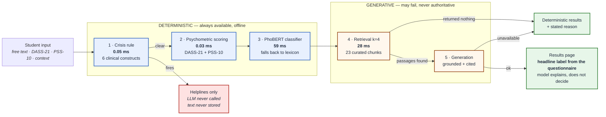
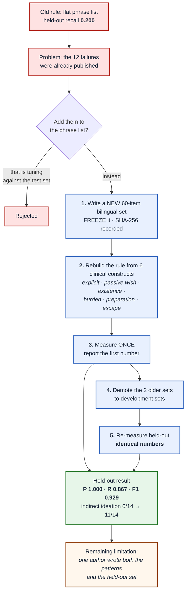
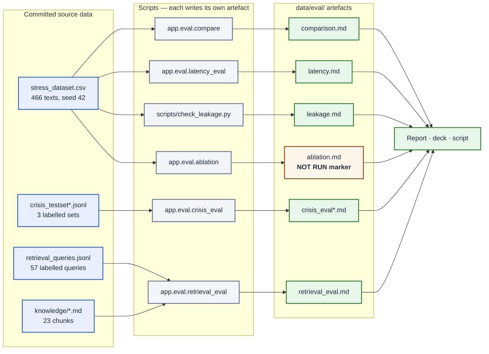

# Diagrams for the defence deck

Paste each block into <https://mermaid.live>, export PNG, and drop it onto the
slide named beside it. Colours match `streamlit_app/ui/tokens.py`, so the
diagrams, the deck and the running application look like one piece of work.

---

## 1 — System architecture  → slide 4

The single most important diagram in the deck. Read it left to right as
**decreasing reliability and decreasing authority at the same time**.

**Say over it:** *"The ordering is a safety property, not an engineering
convenience. The most trustworthy component runs first and can pre-empt
everything after it."*

---

## 2 — Where the headline label comes from  → slide 4 or the Q&A

The answer to *"the model could contradict the questionnaire — which one does
the student see?"*. Worth having ready even if you do not show it.

```mermaid
flowchart TD
    Q["DASS-21 stress severity"] --> MAX
    P["PSS-10 category"] --> MAX
    MAX["Take the MORE SEVERE of the two<br/><i>conservative by design</i>"] --> GT["Ground-truth label<br/><b>this is the headline</b>"]

    T["Student's free text"] --> M["Language model<br/>reads all evidence"]
    Q -.-> M
    P -.-> M
    M --> MP["Model's own reading"]

    GT --> UI["Results page"]
    MP --> UI
    UI --> D{"Do they<br/>differ?"}
    D -- "yes" --> SAY["Say so explicitly:<br/><i>'the model read your writing as X,<br/>which differs from your questionnaire result of Y'</i>"]
    D -- "no" --> QUIET["Show the level<br/>and the explanation"]

    classDef inst fill:#E8F0FE,stroke:#2F63BD,stroke-width:2px,color:#1E293B
    classDef model fill:#FFF7ED,stroke:#92400E,stroke-width:2px,color:#1E293B
    classDef out fill:#E7F6E9,stroke:#2E7D32,stroke-width:2px,color:#1E293B
    class Q,P,MAX,GT inst
    class T,M,MP model
    class SAY,QUIET,UI out
```

**Say over it:** *"The validated instrument owns the headline. The model
explains and suggests. Where they disagree the student is told, rather than the
disagreement being hidden."*

---

## 3 — How the safety rule was rebuilt without cheating  → slide 8

This is the methodological story, and it is the one that separates the project
from a coursework submission. The diagram makes the *order* visible, which is
the whole point.

**Say over it:** *"Fixing it honestly was harder than fixing it. The order came
first, and the order is what makes the number mean anything."*

---

## 4 — Evidence provenance  → slide 13

Every number on a slide traces to a script. Use this if the panel questions
whether the figures are reproducible.

**Say over it:** *"No number in the report exists without a script that produced
it, and where a measurement has not been made the tooling writes an explicit
NOT RUN marker rather than letting a gap look like a zero."*

---

## Rendering notes

- **mermaid.live** → paste → *Actions* → *PNG*. Set a 2× scale for a projector.
- If a diagram is too wide for 16:9, change `flowchart LR` to `flowchart TD`
  (or the reverse) — nothing else needs editing.
- Diagram 1 is the one to show if you only have time for one.
