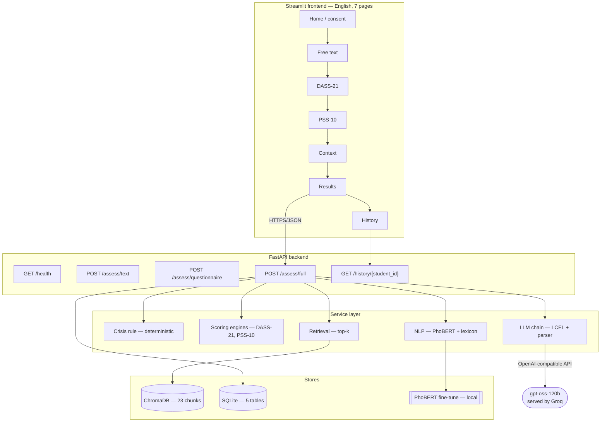
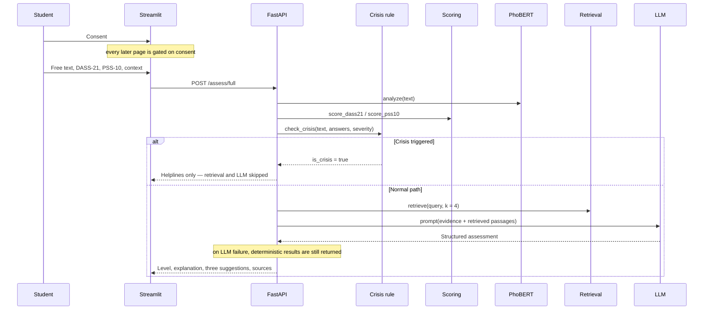
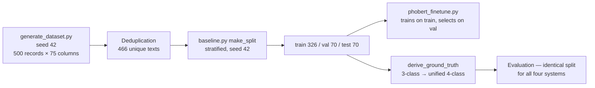

# VIETNAM NATIONAL UNIVERSITY OF HOCHIMINH CITY
# THE INTERNATIONAL UNIVERSITY
# SCHOOL OF COMPUTER SCIENCE AND ENGINEERING

<br>

# An LLM-powered Application for Detecting Academic Stress Levels in Vietnamese University Students

<br>

**By**

**[DRAFT — personalise: YOUR FULL NAME]**

**Student ID: [DRAFT — personalise: STUDENT ID]**

<br>

*A report submitted to the School of Computer Science and Engineering in partial fulfillment of the requirements for the Pre-Thesis course*

<br>

**Supervisor:** [DRAFT — personalise: SUPERVISOR NAME], [DEGREE]

<br>

Ho Chi Minh City, Vietnam

2025–2026

<br><br>

---

**COMMITTEE APPROVAL**

The undersigned have examined this report and approve it in partial fulfillment of the requirements for the Pre-Thesis course.

| | |
|---|---|
| Supervisor | ................................................ |
| Committee Member | ................................................ |
| Committee Member | ................................................ |
| Date | ................................................ |

\newpage

## ACKNOWLEDGMENTS

*[DRAFT — personalise]*

I would like to thank my supervisor, [SUPERVISOR NAME], for guidance throughout this pre-thesis work. I also thank the School of Computer Science and Engineering at the International University, Vietnam National University Ho Chi Minh City, for the resources made available for this project.

*[DRAFT — personalise: add personal acknowledgments to family, friends, and any classmates who assisted with data collection or annotation.]*

\newpage

## ABSTRACT

Academic stress is a persistent concern among Vietnamese university students, yet help-seeking remains low and institutional counselling capacity is limited. This report presents the design, implementation, and preliminary evaluation of a web application that estimates academic stress levels from free text and validated psychometric instruments, and returns coping suggestions grounded in a curated knowledge base. The system combines deterministic scoring of the DASS-21 and PSS-10 instruments, a PhoBERT-based classifier fine-tuned for three-class stress prediction, and a retrieval-augmented large language model producing an explanation and three actionable suggestions. A deterministic crisis-detection rule executes before any language-model call and, when triggered, suppresses the assessment entirely in favour of mental-health helpline information.

Four systems were compared on one frozen, stratified 70-item test split in a unified four-class label space. TF-IDF with logistic regression reached accuracy 0.686 and macro-F1 0.682, the fine-tuned PhoBERT classifier 0.657 and 0.533, zero-shot prompting 0.529 and 0.524, and the full proposed pipeline 0.486 and 0.500. The classical baseline therefore outperformed every neural and generative system tested, and the full pipeline did not improve on zero-shot prompting; both results are read in §5.1 as evidence about the template-generated dataset rather than about the modelling approaches. The crisis-detection rule, measured against a fifty-item hand-labelled Vietnamese development set, yielded precision 0.800, recall 0.500, and F1 0.615, detecting explicit self-harm phrasing in ten of ten cases but indirect ideation in only one of nine. A second fifty-item English set was used as another development set; the deployed application accepts both languages, but PhoBERT runs only on Vietnamese input. The rule was subsequently rebuilt around six constructs drawn from suicide-risk assessment rather than a longer list of fixed phrases, and evaluated on a third set of sixty bilingual items written and frozen before the new patterns existed: precision rose from 0.600 to 1.000 and recall from 0.200 to 0.867 on that held-out set, with indirect ideation improving from none of fourteen to eleven of fourteen and no false positives across twenty deliberately lethal-sounding idioms. Retrieval quality was measured over a purpose-built 57-query labelled set, giving MRR 0.787 and Recall@5 0.903, and a paired comparison of query constructions located a defect in the pipeline itself: reducing a student's text to matched lexicon keywords before retrieving cost 0.269 MRR against retrieving on the sentence. The construction was rewritten on that evidence, raising MRR from 0.509 to 0.839 on the queries it affects. Component ablation was run on a stratified 40-item subsample, while generator faithfulness, human evaluation, multi-seed uncertainty, and end-to-end generation latency remain explicitly unmeasured. The principal limitation is the data: all classification results were computed on text generated from forty-one Vietnamese sentence templates, and a measurement conducted for this report found each test item to be a median 0.799 similar to its nearest training item, with 34 of 70 exceeding 0.80. These figures therefore characterise template memorisation rather than stress detection. Infrastructure for a real-data study is implemented and verified, but no human participants have contributed data. The system screens and estimates; it does not diagnose.

**Keywords:** academic stress, Vietnamese natural language processing, PhoBERT, retrieval-augmented generation, DASS-21, PSS-10, mental-health screening

\newpage

## TABLE OF CONTENTS

*[Auto-generated in the .docx version. The structure is:]*

1. **Introduction** — Background · Problem Statement · Scope and Objectives · Assumptions and Proposed Solution · Contributions · Structure of the Report
2. **Literature Review** — Stress and psychometric instruments · Machine learning for mental-health detection from text · Vietnamese NLP · LLMs and RAG in health-adjacent applications · Comparative analysis and research gap
3. **Methodology and System Design** — Architecture · Data · Psychometric scoring · PhoBERT classifier · Retrieval-augmented advisory module · Fusion and decision logic · Safety architecture · Evaluation methodology
4. **Implementation and Results** — Implementation · Application walkthrough · Dataset statistics · Classifier results · Ablation · RAG evaluation · Safety evaluation · Latency and cost
5. **Discussion and Evaluation** — Interpretation · Comparison with related work · Challenges and limitations · Threats to validity · Ethics · Practical implications
6. **Conclusion and Future Work**

**References**
**Appendix A** — DASS-21 and PSS-10 item lists
**Appendix B** — Full prompt templates
**Appendix C** — Crisis-detection test cases and outcomes
**Appendix D** — Reproducibility commands

## LIST OF FIGURES

| Figure | Caption | Status |
|---|---|---|
| Figure 3. 1 | System architecture | Mermaid source in §3.1 |
| Figure 3. 2 | Primary user journey (sequence) | Mermaid source in §3.1 |
| Figure 3. 3 | Data pipeline | Mermaid source in §3.2 |
| Figure 4. 1 | Label distribution across splits | `data/eval/fig_4_2_label_distribution.png` |
| Figure 4. 2 | PhoBERT training curves | `data/eval/fig_4_3_training_curves.png` |
| Figure 4. 3 | Confusion matrix — fine-tuned PhoBERT | `data/eval/confusion_phobert_ft.png` |
| Figure 4. 4 | Confusion matrix — TF-IDF + LogReg | `data/eval/confusion_tfidf_lr.png` |
| Figure 4. 5 | Macro-F1 across systems | `data/eval/fig_4_6_macro_f1.png` |
| Figure 4. 6 | Ablation — effect of each component | `data/eval/ablation.png` |
| Figure 4. 7 | RAG Recall@k and nDCG@k | `data/eval/retrieval_eval.md` (Tables 4.7–4.8) |
| Figure 4. 8 | Per-stage latency, p50 to p95 | `data/eval/fig_4_9_latency.png` |
| Figure 4. 9 | UI screenshots (7 states) | `[TBD-EXPERIMENT: screenshots]` |
| Figure 4. 10 | Safety red-team outcomes | not run |

## LIST OF TABLES

| Table | Caption | Status |
|---|---|---|
| Table 3. 1 | DASS-21 subscale items and severity cut-offs | computed |
| Table 3. 2 | PSS-10 scoring parameters | computed |
| Table 3. 3 | Unified four-class label mapping | computed |
| Table 4. 1 | Technology stack | computed |
| Table 4. 2 | Dataset statistics per class and split | computed |
| Table 4. 3 | Hyperparameters of every model | computed |
| Table 4. 4 | Main results: all systems | computed for 6 systems |
| Table 4. 5 | Per-class precision/recall/F1, fine-tuned PhoBERT | computed |
| Table 4. 6 | Ablation results | computed for 3 of 5 configurations |
| Table 4. 7 | RAG retrieval quality | computed; faithfulness not measured |
| Table 4. 8 | RAG query-construction comparison | computed |
| Table 4. 9 | RAG faithfulness | not measured |
| Table 4. 10 | Safety evaluation: crisis rule details | computed |
| Table 4. 11 | Safety per-category accuracy | computed |
| Table 4. 12 | Latency of the deterministic pipeline | deterministic path computed; generation not measured |
| Table 5. 1 | Comparison against published related work | partially computed |

\newpage

# CHAPTER 1 — INTRODUCTION

## 1.1 Background

Academic stress among university students is a widely documented public-health concern, and one whose severity is shaped by the educational culture in which it occurs. In Vietnam, academic achievement is closely tied to family expectation and social standing, examination competition is intense, and the transition into university frequently coincides with relocation, financial independence, and the loss of established support networks. These pressures are compounded for students in high-workload disciplines and for those who study far from their home province. Epidemiological studies of stress, anxiety, and depression prevalence among Vietnamese university populations have been conducted, and several report prevalence figures substantially above general-population baselines `[VERIFY — see report/CITATIONS_TO_VERIFY.md]`. This report does not quote a specific prevalence figure, because no source for one has been verified within the scope of this work; the design motivation rests instead on structural factors that can be stated without a contested number.

Two such factors are decisive. The first is the help-seeking gap. Mental-health stigma remains substantial in Vietnam, and students frequently interpret psychological distress as a personal or moral failing rather than a health condition. University counselling services exist but are unevenly resourced, and the act of walking into a counselling office is itself a visible, socially costly signal. The consequence is that the students most in need of support are systematically the least likely to initiate contact. The second factor is capacity: even where students are willing to seek help, the ratio of counsellors to enrolled students at most Vietnamese institutions makes routine screening infeasible by human means alone.

A low-friction, private, self-administered digital screening tool addresses both factors simultaneously. It removes the visibility cost of the first contact, and it scales without consuming counsellor time. Critically, it does not replace clinical judgment — its function is to help a student notice a pattern in their own experience and, where appropriate, to lower the barrier to the next step.

Building such a tool for Vietnamese introduces a distinct set of technical problems that are not solved by transferring an English-language system. Vietnamese is written with a Latin alphabet extended by diacritics that carry both phonemic and tonal information; the loss of diacritics — routine in informal digital writing — is not cosmetic but genuinely ambiguating, since *ma*, *má*, *mà*, *mả*, *mã*, and *mạ* are six distinct words. Vietnamese is further an isolating language in which the orthographic word (syllable) is not the semantic word: *áp lực* ("pressure") is two syllables and one lexical item, which means that whitespace tokenisation, the default assumption of most NLP pipelines, systematically fragments meaning. Student writing compounds these difficulties with *teencode* (deliberate orthographic compression and substitution), heavy code-switching with English technical and academic vocabulary, and register shifts driven by the pronoun system, which encodes social relationship rather than grammatical person. Finally, and most consequentially for a supervised approach, there is no publicly available annotated Vietnamese corpus of student mental-health text comparable to the English resources described in Chapter 2.

## 1.2 Problem Statement

The problem this work addresses can be stated precisely. Given a Vietnamese university student's free-text description of their recent experience, together with optional responses to validated psychometric instruments and optional contextual information about their academic and personal circumstances, the system must produce (i) an estimated academic-stress level on an interpretable ordinal scale, (ii) an explanation that identifies which evidence drove the estimate, and (iii) actionable coping suggestions appropriate to that student's stated circumstances — while never producing a clinical diagnosis, and while reliably diverting students who disclose self-harm risk to human support rather than to an automated assessment.

Four aspects of this problem remain unsolved by existing work. First, the psychometric instruments most commonly used for stress screening are validated as self-report questionnaires, not as targets for text-based prediction; the relationship between what a student writes and what they score is not established for Vietnamese. Second, existing text-based mental-health detection systems are overwhelmingly English-language and trained on social-media corpora whose register differs substantially from a student's reflective self-report. Third, systems that generate advice using large language models face a well-documented hallucination risk that is unacceptable in a mental-health context, and the mitigation — retrieval grounding — is rarely evaluated as a component in its own right. Fourth, the safety layer that such systems require is frequently asserted but rarely measured.

## 1.3 Scope and Objectives

This pre-thesis work is scoped to the design, implementation, and preliminary evaluation of the system described above. It explicitly excludes clinical validation, longitudinal tracking, and deployment to a live student population. Within that scope, five measurable objectives are defined, each mapped to a specific experiment reported in Chapter 4.

**O1 — Implement the two psychometric instruments exactly per their published scoring manuals, with deterministic, testable behaviour.** *Measured by:* unit tests against hand-computed fixtures including all-zero, all-maximum, and reverse-scored edge cases (§4.1, §4.4).

**O2 — Fine-tune a Vietnamese pre-trained language model for text-based stress classification and evaluate it against classical and generative baselines on one identical held-out split.** *Measured by:* accuracy, macro-F1, weighted-F1, per-class precision/recall/F1, and confusion matrices for every system on the same 70-item test set (§4.4, Table 4.3).

**O3 — Construct a retrieval-augmented advisory module over a curated Vietnamese knowledge base, and evaluate the contribution of each pipeline component.** *Measured by:* a five-configuration ablation over retrieval, questionnaire, and emotion features (§4.5), and retrieval-quality metrics over a query set (§4.6).

**O4 — Implement and quantitatively evaluate a crisis-detection safety layer.** *Measured by:* precision, recall, and F1 against a hand-labelled Vietnamese test set the rule was not tuned against, with a per-category breakdown and complete verbatim error lists (§4.7).

**O5 — Establish a reproducible evaluation infrastructure in which no reported number can exist without a script that produced it.** *Measured by:* the proportion of reported figures traceable to a versioned artefact, and the presence of explicit "not run" markers wherever a measurement is absent (§4.1, Appendix D).

Objectives O1, O4 and O5 are met. O2 is partially met: four systems — majority class, TF-IDF with logistic regression, TF-IDF with SVM, the fine-tuned classifier and zero-shot prompting — produced measurements on the identical split, but the full proposed pipeline did not, for the reasons given in §4.4. O3 is partially met: retrieval quality is measured over a labelled query set and grounding is enforced at the prompt, schema and service layers, but the component ablation has not been executed and faithfulness is unmeasured. §6.1 restates each objective against its actual outcome.

## 1.4 Assumptions and Proposed Solution

The proposed solution rests on four assumptions, each of which is revisited as a threat to validity in §5.4.

The first assumption is that the DASS-21 stress subscale and the PSS-10 total, taken together, constitute an acceptable ground-truth label for academic stress level. Both are validated screening instruments for closely related constructs, and combining them by taking the more severe of the two mappings is conservative in a screening context, where sensitivity is preferable to specificity. The composite four-class scale that results is, however, an invention of this project and carries no independent psychometric validation.

The second assumption is that a Vietnamese pre-trained transformer encoder can extract stress-relevant signal from short student self-reports. This is plausible given the demonstrated transfer of such encoders to Vietnamese classification tasks, but it is not established for this particular construct.

The third assumption is that a curated knowledge base of Vietnamese coping strategies, combined with retrieval grounding, sufficiently constrains a general-purpose language model to produce safe, relevant advice. §5.3 argues that the present implementation does not adequately test this assumption.

The fourth assumption is that lexical patterns of explicit self-harm disclosure in Vietnamese are sufficiently regular to support a deterministic detection rule. §4.7 shows that this assumption holds for explicit phrasing and fails for indirect phrasing.

The proposed solution is a layered pipeline in which each layer degrades independently. Deterministic psychometric scoring executes without any external dependency and always produces a result. A locally hosted fine-tuned classifier adds a text-derived signal and, if unavailable, is replaced by lexicon-based keyword matching. A deterministic crisis rule runs before any generative component and can pre-empt the entire pipeline. Retrieval and generation execute last and, if either fails, the system returns its deterministic results rather than an error. This ordering is a safety property, not merely an engineering convenience: the components that can fail unpredictably are precisely those the system can proceed without.

## 1.5 Contributions

This work makes the following contributions.

1. **An end-to-end, working academic-stress screening application** integrating validated psychometric scoring, a fine-tuned Vietnamese transformer classifier, retrieval-augmented generation, and a pre-generative safety layer, implemented as a seven-page English user interface over a documented HTTP API.

2. **A quantitative evaluation of a Vietnamese crisis-detection rule** against a purpose-built fifty-item hand-labelled test set covering explicit ideation, indirect ideation, hyperbole, reported speech, and annotated borderline cases. To the author's knowledge, no comparable Vietnamese evaluation set for this specific task has been published. The rule was measured, not tuned, against this set, and every error is reported verbatim.

3. **A leakage characterisation for template-generated evaluation data.** This report shows that exact-duplicate checking — the standard leakage control — is inadequate for template-generated corpora, and reports a near-duplicate measurement demonstrating that 51 % of test items exceed 0.80 similarity to a training item despite zero exact duplicates.

4. **A reproducible evaluation harness** in which four systems are compared on one frozen split with cached, deterministic language-model responses, and in which unmeasured quantities are recorded as explicit "not run" markers rather than omitted or estimated.

5. **A documented safety and consent architecture** for Vietnamese student mental-health data collection, including a consent instrument, participant instructions, anonymised export, and automated data-quality screening, together with an explicit account of where the implementation currently falls short of what the consent instrument promises (§5.5).

## 1.6 Structure of the Report

Chapter 2 reviews stress instrumentation, text-based mental-health detection, Vietnamese language modelling, and retrieval-augmented generation in health-adjacent settings, concluding with the research gap this work addresses. Chapter 3 presents the system architecture, the data pipeline, the exact scoring formulas, the classifier and retrieval designs, the fusion logic, the safety architecture, and the evaluation methodology. Chapter 4 reports the implementation and every measurement obtained. Chapter 5 interprets those measurements, compares them with related work, and states the limitations and threats to validity in detail. Chapter 6 concludes against the five objectives and sets out future work.

\newpage

# CHAPTER 2 — LITERATURE REVIEW

## 2.1 Stress and its psychometric instrumentation

Psychological stress is conventionally modelled as arising from a perceived imbalance between environmental demand and the individual's appraised capacity to cope. Two self-report instruments dominate applied screening for this construct, and both are used in this work.

The **Depression Anxiety Stress Scales — 21 item version (DASS-21)** was derived by Lovibond and Lovibond [1] from the 42-item DASS as a measure of three related but separable negative emotional states. Its stress subscale targets persistent non-specific arousal: difficulty relaxing, nervous tension, irritability, and over-reactivity. Each of the twenty-one items is rated 0–3 over the preceding week; the three subscales of seven items each are summed and doubled to remain comparable with the full DASS, and the doubled score is mapped onto five severity bands. The instrument is explicitly a dimensional screening measure, not a diagnostic instrument, a distinction that is load-bearing for the present work.

The **Perceived Stress Scale (PSS)** was introduced by Cohen, Kamarck, and Mermelstein [2] to measure the degree to which life circumstances are appraised as unpredictable, uncontrollable, and overloading. The ten-item form used here rates each item 0–4 over the preceding month, with four positively worded items reverse-scored. Cohen and Williamson [3] later published normative data for a United States probability sample. It is worth stating plainly that Cohen did not publish clinical cut-off scores for the PSS-10; the tripartite 0–13 / 14–26 / 27–40 division used throughout applied research, and adopted in this work, is a widely reproduced convention rather than a validated threshold, and §3.3 treats it accordingly.

Both instruments have been translated into Vietnamese, and validation work on the Vietnamese DASS-21 has been published [4]. The situation for the Vietnamese PSS-10 is less clear within the scope of this review. An earlier revision of this system deployed such Vietnamese wording; the system now deploys the original published English items of both instruments, which is why §5.4 no longer treats item provenance as an open construct-validity threat.

## 2.2 Machine learning for mental-health detection from text

Automated detection of psychological state from written language has developed through three overlapping phases.

**Classical feature engineering.** Early work relied on lexicon-based and surface features: word-category counts, sentiment lexicons, pronoun usage, and n-gram frequency, typically combined with linear classifiers or support vector machines. These approaches remain relevant as baselines, and they retain two practical advantages — interpretability and low data requirements — that matter in a domain where labelled data is scarce. Chapter 4 shows that on this project's data a TF-IDF linear model is not merely a formality but the strongest measured system, a result whose interpretation is examined in §5.1.

**Neural sequence models.** Recurrent and convolutional architectures over distributed word representations improved on n-gram features where sufficient labelled data existed, but did not fundamentally change the data-scarcity problem.

**Transfer learning from pre-trained transformers.** The introduction of deeply bidirectional pre-trained encoders [5] shifted the field decisively, because it permitted competitive performance from hundreds rather than tens of thousands of labelled examples. This is the regime in which the present work operates.

The datasets that have shaped this field are, without exception relevant here, **English**. The CLPsych shared tasks [6] established evaluation of depression and PTSD signals in Twitter data. **Dreaddit** [7] provides Reddit posts annotated for stress across five domains, and is the closest published analogue to the present task. The **eRisk** series [8] introduced early-risk detection over sequential user posts. Each of these is a valuable methodological reference and none is directly usable here: the language differs, and so does the register — social-media posting is public performance, whereas a private self-report to a screening tool is not. Chapter 5 returns to this point when discussing why cross-paper metric comparison would be misleading.

## 2.3 Vietnamese natural language processing

Vietnamese NLP faces the structural challenges described in §1.1, and two resources address them directly.

**PhoBERT** [9] is a RoBERTa-architecture model pre-trained on a 20 GB Vietnamese corpus, released in base and large configurations. It is the standard encoder for Vietnamese classification tasks and is the model fine-tuned in this work. A methodological detail of PhoBERT is central to §3.4 and §5.3: it was pre-trained on **word-segmented** text, in which multi-syllable lexical items are joined. Feeding unsegmented text to PhoBERT therefore presents it with a token distribution unlike its pre-training distribution.

**VnCoreNLP** [10] provides the word segmentation, POS tagging, and dependency parsing components that PhoBERT's pre-training pipeline assumed. Segmentation is the relevant component here.

**XLM-RoBERTa** [11] offers a multilingual alternative pre-trained on one hundred languages including Vietnamese. It is a natural comparator for a Vietnamese classification task, though it is not evaluated in this work (§4.4).

**ViSoBERT** [12] targets Vietnamese social-media text specifically, and is therefore of interest for the teencode and code-switching phenomena described in §1.1.

For sentence-level semantic retrieval, **Sentence-BERT** [13] established the bi-encoder architecture, and the multilingual distillation approach of Reimers and Gurevych [14] produced the multilingual sentence encoders on which this system's retrieval component depends.

The decisive gap in this area is resource availability: no public Vietnamese corpus of annotated student mental-health text is known to the author. This scarcity is the direct cause of the synthetic-data approach adopted here, and of that approach's limitations.

## 2.4 Large language models and retrieval-augmented generation in health-adjacent applications

Large language models [15] exhibit strong instruction-following and zero-shot classification ability, which makes them attractive for tasks with little labelled data — precisely the situation of this project. They also exhibit a failure mode that is unacceptable in a health context: the generation of fluent, confident, and false statements. Ji et al. [16] survey this phenomenon across generation tasks and distinguish intrinsic hallucination, which contradicts the provided source, from extrinsic hallucination, which cannot be verified from it.

**Retrieval-augmented generation** [17] is the principal architectural mitigation. By retrieving relevant passages from a controlled corpus and conditioning generation on them, RAG constrains the model's assertions to a curated evidence base and creates the possibility of attribution. The mitigation is, however, conditional on three properties that are frequently assumed rather than verified: that retrieval actually returns relevant passages, that the model actually uses them, and that the system behaves safely when retrieval returns nothing. §5.3 reports that the present implementation satisfies none of these conditions in a demonstrated way, and §6.2 treats this as the primary item of future work.

In mental-health applications specifically, the literature emphasises that fluency and empathy are not the operative safety properties. What matters is reliable escalation on risk disclosure, refusal to diagnose, and avoidance of advice that could substitute for professional care. These are architectural requirements rather than prompt-engineering preferences, which motivates the pre-generative crisis gate described in §3.7.

## 2.5 Comparative analysis and research gap

Table 2.1 summarises representative related work along the dimensions relevant to this project.

**Table 2. 1: Representative related work**

| Work | Language | Data | Method | Metric reported | Limitation for this task |
|---|---|---|---|---|---|
| Lovibond & Lovibond [1] | English | Clinical + community samples | Factor-analytic instrument development | Subscale reliability, factor structure | Self-report instrument; no text modality |
| Cohen et al. [2] | English | Community samples | Instrument development | Internal consistency, correlations | No clinical cut-offs published |
| Tran et al. [4] | Vietnamese | Rural community cohort | Translation + validation of DASS-21 | Screening sensitivity/specificity | Not a student population; no text modality |
| CLPsych shared tasks [6] | English | Twitter | Supervised classification | Precision/recall/F1 | English; public social-media register |
| Turcan & McKeown [7] | English | Reddit (Dreaddit) | Supervised classification | Accuracy, F1 | English; public posts, not self-report |
| Losada & Crestani [8] | English | Reddit, sequential | Early-risk detection | ERDE, F1 | English; longitudinal data unavailable here |
| Devlin et al. [5] | English | BooksCorpus + Wikipedia | Pre-trained bidirectional encoder | GLUE | General-purpose; not Vietnamese |
| Nguyen & Nguyen [9] | Vietnamese | 20 GB Vietnamese text | Pre-trained encoder (PhoBERT) | POS, NER, NLI | Requires word-segmented input |
| Vu et al. [10] | Vietnamese | — | Segmentation/POS/parsing toolkit | Segmentation F1 | Toolkit, not a mental-health method |
| Conneau et al. [11] | 100 languages | CommonCrawl | Multilingual encoder (XLM-R) | XNLI | Not Vietnamese-specialised |
| Reimers & Gurevych [14] | 50+ languages | Parallel corpora | Multilingual sentence embeddings | STS | Retrieval component only |
| Lewis et al. [17] | English | Wikipedia | Retrieval-augmented generation | Exact match, F1 | Open-domain QA, not advisory generation |
| Ji et al. [16] | — | Survey | Hallucination taxonomy | — | Descriptive; no mitigation evaluation |

**Research gap.** The literature provides validated stress instruments without a text modality; English text-based detection systems trained on a public social-media register that differs from private self-report; Vietnamese pre-trained encoders without any mental-health corpus to fine-tune them on; and a retrieval-augmentation architecture whose safety benefits are widely assumed but seldom measured as a component. No published work known to the author combines validated psychometric scoring, Vietnamese text classification, and retrieval-grounded advisory generation into a single evaluated system for Vietnamese university students, nor reports a quantitative evaluation of a Vietnamese crisis-detection layer. This project addresses that combination directly, and — as Chapters 4 and 5 make explicit — succeeds in constructing and partially evaluating it, while leaving the retrieval-quality and faithfulness questions open.

\newpage

# CHAPTER 3 — METHODOLOGY AND SYSTEM DESIGN

## 3.1 Overall architecture

The system is organised as a three-tier application: an English-language Streamlit frontend, a FastAPI backend exposing six HTTP endpoints, and a service layer comprising five independent components over three data stores. Figure 3.1 shows the component structure.

**Figure 3. 1: System architecture**



The rationale for each component choice is as follows. **Streamlit** was selected for the frontend because the interface is a linear multi-page form with charting, for which Streamlit's declarative model is well suited and which requires no separate frontend build pipeline. **FastAPI** provides typed request and response validation through Pydantic, automatic OpenAPI documentation, and native asynchronous support, the last of which matters because the language-model call dominates end-to-end latency. **SQLite** was chosen over a client-server database because the deployment target is a single machine and the data volume is small; the schema is portable to PostgreSQL without modification. **ChromaDB** provides a persistent local vector store requiring no separate service. **PhoBERT** is the standard Vietnamese encoder (§2.3). The separation of frontend and backend across an HTTP boundary is deliberate: it permits the scoring and safety logic to be tested and evaluated independently of any user interface, and it is what allows the evaluation harness in Chapter 4 to exercise exactly the production code path.

The ordering of components within a request is a safety property rather than an implementation detail, and is shown in Figure 3.2.

**Figure 3. 2: Primary user journey**



## 3.2 Data

**Provenance.** No public Vietnamese corpus of annotated student mental-health text exists (§2.3). The dataset used for all classification experiments in this report is therefore **synthetic**, generated by a purpose-written script. Each record is driven by a single latent stress variable $\theta \in [0,1]$ sampled from a three-component mixture of Beta distributions, ensuring that free text, questionnaire responses, and contextual variables remain mutually consistent within a record. Given $\theta$, DASS-21 item responses are sampled as

$$a_i = \mathrm{clip}\!\left(\mathrm{round}\!\left(\mathcal{N}\!\left(3.2\,\theta + b_{s(i)},\, 0.7\right)\right),\, 0,\, 3\right) \tag{3.1}$$

where $a_i$ is the response to item $i$, $s(i)$ is the subscale of item $i$, and $b_{s} \sim \mathcal{N}(0, 0.35)$ is a per-record subscale bias that models students who skew anxious rather than depressed. PSS-10 items are sampled analogously, with positively worded items drawing on $(1-\theta)$ rather than $\theta$.

Free text is assembled by sampling from a bank of **41 Vietnamese sentence fragments** organised into three stress bands and four rhetorical slots (opener, detail, symptom, coping), with the dominant academic stressor, lifestyle stressor, and coping resource substituted into template placeholders. This construction is the single most important limitation of the entire evaluation and is treated at length in §5.3.

**Preprocessing.** Text is NFC-normalised, lowercased, and whitespace-collapsed for lexicon matching. Vietnamese word segmentation is **not** applied, either at fine-tuning or at inference. This is a deliberate, documented decision: applying segmentation at only one of the two stages would create a train/inference distribution mismatch that silently degrades accuracy, whereas omitting it at both stages is merely uniformly suboptimal relative to PhoBERT's pre-training distribution (§2.3). §6.2 lists the segmentation ablation as future work.

**Splits.** A stratified 70/15/15 partition was drawn once with seed 42 and frozen to disk. Every subsequent experiment reuses this exact partition. The reason for freezing rather than redrawing is specific and important: the PhoBERT checkpoint was fine-tuned on the training portion of this partition, so any newly drawn split would place former training items into the test set and inflate that system's score. Figure 3.3 shows the resulting pipeline.

**Figure 3. 3: Data pipeline**



**Label derivation.** The evaluation label space is the unified four-class scale defined in §3.6, derived per record from the DASS-21 stress subscale severity and the PSS-10 category. This is computed by exactly the same function the running application uses, so the evaluation label and the production label can never diverge.

**Data card summary.** Source: fully synthetic, script-generated, no human subjects. Size: 466 records after deduplication. Language: Vietnamese. Annotation: labels are derived deterministically from generated instrument responses; there is no human annotation and therefore no inter-annotator agreement to report. Known biases: text originates from 41 fragments and therefore has severely restricted lexical diversity; the generator encodes the author's assumptions about how Vietnamese students describe stress; no dialectal, gender, faculty, or year-of-study variation is modelled beyond the demographic fields, which do not influence text generation. A real-data collection pipeline exists and is described in §4.1, but has not been executed.

## 3.3 Psychometric scoring engine

Both instruments are implemented as pure deterministic functions with no external dependencies, and both validate their inputs strictly.

**DASS-21.** Let $A = \{a_1, \dots, a_{21}\}$ with $a_i \in \{0,1,2,3\}$, and let $I_d$, $I_a$, $I_s$ partition the item indices into the depression, anxiety, and stress subscales, each of cardinality 7. The subscale score is

$$S_k = 2 \sum_{i \in I_k} a_i, \qquad k \in \{d, a, s\} \tag{3.2}$$

where the factor of 2 restores comparability with the 42-item DASS from which the short form was derived [1]. Each $S_k$ is mapped to a severity band by the cut-offs in Table 3.1, and the reported overall severity is the maximum severity across the three subscales.

**Table 3. 1: DASS-21 subscale items and severity cut-offs (applied to doubled scores)**

| Subscale | Item indices | Normal | Mild | Moderate | Severe | Extremely Severe |
|---|---|---|---|---|---|---|
| Depression | 3, 5, 10, 13, 16, 17, 21 | 0–9 | 10–13 | 14–20 | 21–27 | ≥ 28 |
| Anxiety | 2, 4, 7, 9, 15, 19, 20 | 0–7 | 8–9 | 10–14 | 15–19 | ≥ 20 |
| Stress | 1, 6, 8, 11, 12, 14, 18 | 0–14 | 15–18 | 19–25 | 26–33 | ≥ 34 |

*Source: Lovibond & Lovibond [1]. Implementation verified item-by-item against the published manual; no deviation.*

**PSS-10.** Let $R = \{r_1, \dots, r_{10}\}$ with $r_j \in \{0,\dots,4\}$ and let $J = \{4,5,7,8\}$ denote the positively worded items. The total is

$$P = \sum_{j \notin J} r_j + \sum_{j \in J} (4 - r_j) \tag{3.3}$$

giving $P \in [0, 40]$, categorised as shown in Table 3.2.

**Table 3. 2: PSS-10 scoring parameters**

| Parameter | Value |
|---|---|
| Items | 10, rated 0–4 |
| Reverse-scored items | 4, 5, 7, 8 |
| Total range | 0–40 |
| Low | 0–13 |
| Moderate | 14–26 |
| High | 27–40 |

*Source: instrument from Cohen et al. [2]; normative data from Cohen & Williamson [3]. The tripartite band division is a widely reproduced convention rather than a published clinical cut-off, and is adopted here as such — see §5.4.*

Both scorers reject any input that is not exactly the expected item set with values in the expected range, including a guard against Python's `bool` being accepted as `int`. This strictness is intentional: a silently mis-scored screening instrument is a worse failure than a rejected request.

## 3.4 PhoBERT-based classifier

**Architecture.** The classifier is `vinai/phobert-base` [9] — a 12-layer RoBERTa encoder with hidden size 768, 12 attention heads, and a 64 001-token byte-pair vocabulary — with a randomly initialised classification head over the pooled `<s>` representation. The head projects to three classes: Low, Moderate, High.

**Tokenisation and pooling.** Input is tokenised with the PhoBERT BPE tokenizer to a maximum of 160 tokens during fine-tuning and 256 at inference, with truncation. Classification uses the standard RoBERTa sequence-classification head: a dense layer with `tanh` activation over the first-token representation, followed by dropout and a linear projection to class logits.

**Loss.** Training minimises class-weighted cross-entropy to counter label imbalance:

$$\mathcal{L} = -\frac{1}{N}\sum_{n=1}^{N} w_{y_n} \log \frac{\exp(z_{n,y_n})}{\sum_{c=1}^{C} \exp(z_{n,c})}, \qquad w_c = \frac{N}{C \cdot N_c} \tag{3.4}$$

where $z_{n,c}$ is the logit for class $c$ on example $n$, $y_n$ the true class, $C = 3$, $N$ the training-set size, and $N_c$ the count of class $c$ in the training set.

**Optimiser.** AdamW is used with decoupled weight decay. For parameter $\vartheta$ at step $t$:

$$m_t = \beta_1 m_{t-1} + (1-\beta_1) g_t, \qquad v_t = \beta_2 v_{t-1} + (1-\beta_2) g_t^2 \tag{3.5}$$

$$\hat{m}_t = \frac{m_t}{1-\beta_1^t}, \qquad \hat{v}_t = \frac{v_t}{1-\beta_2^t} \tag{3.6}$$

$$\vartheta_t = \vartheta_{t-1} - \eta_t\left(\frac{\hat{m}_t}{\sqrt{\hat{v}_t}+\epsilon} + \lambda\, \vartheta_{t-1}\right) \tag{3.7}$$

where $g_t$ is the gradient, $\beta_1, \beta_2$ the exponential decay rates, $\eta_t$ the scheduled learning rate, $\lambda$ the weight-decay coefficient, and $\epsilon$ a numerical-stability constant.

**Scheduler and regularisation.** A linear schedule with 10 % warmup decays $\eta_t$ from its peak to zero over the total step count. Gradients are clipped to unit $\ell_2$ norm. Model selection is by best validation macro-F1 across epochs, with the selected state restored before evaluation. Complete hyperparameters appear in Table 4.2.

**Degradation behaviour.** The classifier is loaded lazily and cached per process. If the checkpoint directory is absent or loading fails for any reason, the NLP component logs a warning and proceeds with lexicon-only analysis rather than failing the request. Sentiment polarity is derived from the classifier output and the lexicon match count rather than from a separate sentiment model, which keeps the entire NLP stack offline; the acknowledged cost is that this derivation cannot detect positive sentiment, so neutral is its honest floor.

## 3.5 Retrieval-augmented advisory module

**Corpus.** The knowledge base comprises six English Markdown documents written for this project: academic stress and its sources; coping strategies; mental-health support resources available in Vietnam; sleep and academic performance; the DASS-21 and PSS-10 instruments; and family, financial, and social-comparison pressure. The corpus is authored rather than sourced, which is a limitation stated in §5.3.

**Chunking.** Documents are split at second-level Markdown headings, with the document title prepended to every chunk so that each chunk remains self-describing under embedding. Sections exceeding 1 500 characters are further split on paragraph boundaries. Chunk identifiers are deterministic functions of source file and index, making ingestion idempotent. The corpus yields **23 chunks with a mean length of 553 characters**.

**Embedding and retrieval.** Chunks are embedded with `paraphrase-multilingual-MiniLM-L12-v2`, a multilingual sentence encoder produced by the distillation method of Reimers and Gurevych [14], and indexed in ChromaDB under cosine distance with HNSW. At query time the system composes a retrieval query from the strongest available signal — matched stress keywords if present, otherwise the first 300 characters of the student's text — augmented with the derived stress level, and retrieves the top $k = 4$ chunks. No similarity threshold and no reranking are applied. Retrieval never raises: on an empty collection or any exception it returns an empty list.

**Prompt.** The system prompt is reproduced verbatim in Appendix B. Its operative constraints are that the assistant is not a physician and must not name any disorder; that the explanation must be written in a peer register and must cite the specific evidence that drove the conclusion; that exactly three concrete, week-scale suggestions must be produced; that those suggestions may not introduce advice, services, contact numbers or clinical claims absent from the retrieved reference material, and that a gap in that material must be stated rather than filled from the model's own knowledge; that every suggestion must be attributed to the chunk identifiers shown in the input; that concerning signals must be added to a risk-flag list; and that the predicted level must be one of the four permitted values, with confidence reduced when sources conflict.

**Structured output.** Generation is constrained by a Pydantic output parser whose schema requires a predicted level from the four-class enumeration, a confidence in $[0,1]$, an explanation, three to five suggestions, a risk-flag list, and a list of citations. Schema violations raise, and the calling service catches them and returns deterministic results.

**Citation verification.** Each retrieved passage is presented to the model prefixed with its stable chunk identifier, and the model is required to cite those identifiers. The service then intersects the returned citations with the identifiers actually retrieved for that request and discards the remainder. This matters because an unverified citation is worse than none: it asserts a provenance the system cannot stand behind. Only the surviving citations are shown to the student, under a heading that distinguishes what the advice was drawn from from what was merely searched.

**Refusal on empty retrieval.** If retrieval returns nothing, the generator is not invoked at all and the response carries an explicit reason, which the interface displays. Deterministic questionnaire scoring is unaffected. The alternative — generating anyway — would produce exactly the ungrounded mental-health advice the retrieval layer exists to prevent.

An important honest qualification: the prompt instructs the model to **prioritise** the retrieved passages, not to answer **exclusively** from them, and the output schema contains no per-claim citation field. The system therefore implements retrieval augmentation but not retrieval grounding in the strict sense. §5.3 treats this as a substantive limitation rather than a detail.

## 3.6 Fusion and decision logic

Two independent estimates of stress level exist within a completed assessment: the deterministic instrument-derived label and the language model's predicted level. The instrument-derived label is computed as

$$L_{\text{inst}} = \max\big(\phi_{\text{DASS}}(\sigma_s),\ \phi_{\text{PSS}}(c)\big) \tag{3.8}$$

where $\sigma_s$ is the DASS-21 stress-subscale severity, $c$ the PSS-10 category, $\phi_{\text{DASS}}$ and $\phi_{\text{PSS}}$ the mappings in Table 3.3, and the maximum is taken over the ordinal scale Low < Moderate < High < Severe.

**Table 3. 3: Unified four-class label mapping**

| DASS-21 stress severity | → | PSS-10 category | → |
|---|---|---|---|
| Normal | Low | Low | Low |
| Mild | Moderate | Moderate | Moderate |
| Moderate | Moderate | High | High |
| Severe | High | — | — |
| Extremely Severe | Severe | — | — |

Taking the maximum is conservative: in a screening context, a false positive costs a student an unnecessary moment of reflection, whereas a false negative costs a missed opportunity to intervene.

**Disagreement handling.** The instrument-derived label $L_{\text{inst}}$ is authoritative for the headline result whenever the student completed a questionnaire. The language model supplies the headline only when no questionnaire exists; otherwise its contribution is confined to the explanation and the three suggestions. Where the model's predicted level differs from $L_{\text{inst}}$, the interface states the divergence to the student and attributes the headline to the questionnaire, rather than resolving the conflict silently in either direction. The divergence rate is computed over the stored predictions by `compute_metrics`, which reports `disagreement_rate` alongside the classification metrics. An earlier revision inverted this precedence, displaying the model's level as the headline and treating the instrument as a fallback; §5.4 records why that was a construct-validity threat. **The rate itself remains unmeasured**, because the language-model systems have not been run (§4.4).

## 3.7 Safety architecture

**Crisis detection.** A deterministic rule executes before retrieval and before any generative call. It fires when any of three conditions holds: the free text contains one of the explicit self-harm or suicide phrases in the lexicon under diacritic-normalised substring matching (fourteen Vietnamese phrases at the time of the §4.7 measurement; twenty-two English phrases were added alongside them when the interface moved to English, see Appendix C.1); DASS-21 items 17 ("I felt I wasn't worth much as a person") and 21 ("I felt that life was meaningless") are both answered at maximum; or the depression subscale reaches Extremely Severe with either risk item at 2 or above.

**Escalation.** When the rule fires, the pipeline returns immediately with a crisis message listing the Ngày Mai helpline, the national 111 line, emergency services, and campus counselling, together with an instruction not to remain alone. The message is written in English, but the helplines remain Vietnamese services, since the deployment audience is students in Vietnam. Retrieval and generation are skipped entirely — not merely suppressed in the interface, but never invoked. The results page renders the helpline block and terminates before any analysis component is drawn.

**Non-retention of crisis disclosures.** The rule also executes before any database write. Every assessment endpoint computes its analysis in memory, evaluates the rule, and only then persists; when the rule fires the request is not recorded at all, and the application log receives the trigger reasons but never the text that produced them. This ordering is deliberate: an earlier revision persisted the free text first and evaluated the rule afterwards, which meant the most sensitive disclosures in the system were also the ones most certainly written to disk. The behaviour is enforced by tests rather than convention.

**Right to withdraw.** `DELETE /session/{student_id}` erases every row associated with an anonymised identifier across all five tables, and is exposed in the interface as a two-step confirmation on the History page. The anonymised identifier is the only handle that exists, so possession of it is what authorises erasure, exactly as it is what authorises reading the history.

**Refusal policy.** The system prompt forbids diagnostic language explicitly and by example. Every response carries a non-diagnostic disclaimer at the schema level, so the disclaimer cannot be omitted by an interface change.

**Design rationale.** Placing the crisis rule before generation, and making it deterministic rather than model-based, means the safety-critical path contains no component whose behaviour is unpredictable, non-reproducible, or dependent on a network service. The cost of this choice is recall, as §4.7 documents.

## 3.8 Evaluation methodology

**Metrics.** For $C$ classes with per-class precision $\mathrm{P}_c$, recall $\mathrm{R}_c$:

$$\mathrm{F1}_c = \frac{2\,\mathrm{P}_c\,\mathrm{R}_c}{\mathrm{P}_c + \mathrm{R}_c}, \qquad \text{macro-F1} = \frac{1}{C}\sum_{c=1}^{C}\mathrm{F1}_c, \qquad \text{weighted-F1} = \sum_{c=1}^{C}\frac{N_c}{N}\mathrm{F1}_c \tag{3.9}$$

Macro-F1 is the primary metric because the label distribution is imbalanced and the minority class is the clinically most consequential one. Chance-corrected agreement is reported as Cohen's $\kappa$:

$$\kappa = \frac{p_o - p_e}{1 - p_e} \tag{3.10}$$

where $p_o$ is observed agreement and $p_e$ agreement expected by chance from the marginals.

For the crisis rule, the positive class is "crisis", and precision, recall, and F1 are reported with the complete confusion counts, because in this application the two error types have asymmetric costs and must not be collapsed into a single figure.

**Systems compared.** Four systems on one identical frozen test split in one label space: (i) TF-IDF word 1–2 grams with logistic regression; (ii) the fine-tuned PhoBERT classifier; (iii) a zero-shot language-model classifier receiving raw text only; (iv) the full proposed pipeline receiving text, emotion features, questionnaire scores, and retrieved passages.

A structural caveat applies to system (ii). The fine-tuned model has three classes and the evaluation label space has four; the mapping is the identity on the three shared labels. The model therefore cannot emit "Severe", and its recall on that class is zero by construction. No score-threshold remapping was applied, because any such remapping would be arbitrary; the limitation is reported rather than concealed.

A validity caveat applies to system (iv). Its prompt contains the DASS-21 and PSS-10 scores from which the ground-truth label is derived, so its agreement with that label is partly definitional. The `no_questionnaire` ablation configuration is the honest text-only comparison point.

**Ablation.** Five configurations over the same engine as system (iv), toggling retrieval, questionnaire features, and emotion features: `full`, `no_rag`, `no_questionnaire`, `no_emotion`, `text_only`. Using the production engine with feature switches — rather than a reimplementation — guarantees that an ablation configuration and the headline system cannot drift apart.

**Determinism and reproducibility.** Language-model responses are cached on disk keyed by a SHA-256 hash of the full input including model identity and configuration, so a repeated evaluation performs zero API calls and returns identical results. The exact evaluated dataframe, including the split column, is written to disk on every run. Evaluation defaults to offline model loading so that a slow network cannot alter or stall a run.

**Statistical treatment — stated as a gap.** All results in this report are single-seed. Multi-seed runs with mean and standard deviation, bootstrap confidence intervals for macro-F1, and McNemar's test between the proposed system and the strongest baseline are specified in the evaluation design but have not been executed, and are marked `[TBD-EXPERIMENT]` wherever they would appear.

**Human evaluation — stated as a gap.** An instrument for rating model explanations on accuracy, helpfulness, and respectfulness, with Krippendorff's $\alpha$ for inter-rater agreement [18], and a Vietnamese System Usability Scale instrument [19] with Bangor bands [20], are implemented and unit-tested. Neither has been administered to raters or participants, and no figures from either appear in this report.

\newpage

# CHAPTER 4 — IMPLEMENTATION AND RESULTS

## 4.1 Implementation

**Technology stack.** Table 4.1 lists the components actually used.

**Table 4. 1: Technology stack**

| Layer | Technology | Role |
|---|---|---|
| Frontend | Streamlit | Seven-page Vietnamese interface |
| Backend | FastAPI + Uvicorn | Five HTTP endpoints, async |
| Validation | Pydantic v2 | Request/response schemas, LLM output parsing |
| Configuration | pydantic-settings | Environment-driven settings singleton |
| Persistence | SQLAlchemy 2.0 + SQLite | Five-table relational schema |
| Encoder | `vinai/phobert-base` via Transformers | Text stress classification |
| Deep learning | PyTorch (CPU) | Fine-tuning and inference |
| Vector store | ChromaDB | 23-chunk knowledge index, cosine HNSW |
| Embeddings | `paraphrase-multilingual-MiniLM-L12-v2` | Multilingual sentence encoding |
| LLM orchestration | LangChain (LCEL) | `prompt \| llm \| parser` chain |
| LLM | `openai/gpt-oss-120b` served by Groq through an OpenAI-compatible endpoint (provider is a configuration value), temperature 0.2 | Assessment generation |
| Classical ML | scikit-learn | TF-IDF baseline, metrics |
| Visualisation | Plotly (UI), Matplotlib (figures) | Charts and evaluation plots |
| Testing | pytest, pytest-cov | 337 tests |
| Quality | Ruff, GitHub Actions | Linting and CI |
| Packaging | Docker, Docker Compose | Reproducible deployment |

**Repository structure.** Application code is separated into `app/` (scoring, NLP, LLM, RAG, API, schemas, persistence, evaluation), `streamlit_app/` (interface and an internal design-system package), `research/` (frozen dataset generation, split creation, and fine-tuning scripts), `scripts/` (data export and quality reporting), `tests/`, `data/` (knowledge base, generated datasets, vector store), and `docs/`.

**Hardware and environment.** Fine-tuning and all evaluation were performed on CPU (Windows 11, Python 3.13). The published continuous-integration workflow runs on Ubuntu with Python 3.11 and CPU-only PyTorch.

**Verification status.** The test suite comprises **337 tests, all passing**, with **94 % statement coverage of the application code** (`app/` excluding the offline evaluation tooling in `app/eval/`; 70 % when that tooling is included, because the latency and figure scripts are exercised by running them rather than by tests). Coverage of the components on which correctness most depends is higher still: the scoring engines and the crisis rule are at 100 %, the retriever at 100 %, the persistence models at 100 %, the assessment orchestration at 95 %, the API layer at 97 %, and the LLM chain at 88 %.

**Implementation challenges and resolutions.** Four are worth recording.

*Model availability.* Requiring a network download at request time introduced multi-minute stalls on a slow connection. The resolution was to remove the last hub-dependent model entirely and derive sentiment polarity from the local classifier and lexicon, making the NLP stack fully offline. The accepted cost is that the derived polarity cannot detect positive sentiment.

*Evaluation cost and determinism.* Evaluating language-model systems over a test split repeatedly is both expensive and non-deterministic. The resolution was a content-addressed disk cache keyed by a hash of the full input including model identity, making repeated runs free and exactly reproducible.

*Split reuse versus redrawing.* The natural instinct is to redraw a split for a new evaluation. Because the PhoBERT checkpoint had already been fine-tuned on an existing partition, redrawing would have leaked former training items into the test set. The resolution was to freeze and reuse the original partition for every system.

*Progress feedback in questionnaire forms.* Streamlit's form component defers reruns until submission, which froze the item-completion counter at zero while a student worked through twenty-one items. The resolution was to abandon the form component on the questionnaire pages and persist each answer to session state on interaction.

**Real-data collection infrastructure.** A complete pipeline exists: a Vietnamese consent instrument, participant instructions, a command-line export that strips demographic fields and emits one row per participant in the evaluation schema, and an automated quality report flagging straight-lining, texts under twenty words, completion under 120 seconds, and DASS/PSS divergence of two or more unified levels. The toolkit was verified end-to-end against a synthetic database. Administrative access is deliberately command-line only; the participant-facing application ships no data-export surface. **No human participants have contributed data, so no result in this report derives from real text.**

## 4.2 Application walkthrough

The interface implements the seven-stage flow of Figure 3.2. The home page presents the purpose, a six-point consent checklist covering eligibility, the non-diagnostic nature of the tool, third-party processing, retention, the right to erase, and voluntary participation, together with optional background fields; consent is required before any other page will render, enforced by a gate function called at the top of every page. The free-text page offers optional mood prompts that seed an opening sentence the student may edit or delete — the mood itself is never transmitted. The two questionnaire pages present items with their published response labels and a live completion counter. The context page collects optional academic, lifestyle, and coping information. The results page opens with a plain-language statement of what the result means and does not mean, and only then presents the level badge, a gauge, subscale bar chart, a normalised radar profile, risk and protective factors, the model's explanation, three suggestions, and the retrieved source list. The history page shows a trend chart, a timeline across assessments, and the control that erases the participant's data.

Two design rules governed the results page. First, it never leads with a number, on the reasoning that a student arriving at this page may already be anxious. Second, stress level is never conveyed by colour alone: every level indicator carries its Vietnamese text label, and the palette's contrast ratios were measured rather than assumed, with darkened ink variants defined for any glyph or label rendered on a light surface.

**Figure 4. 1: User interface screenshots — consent, questionnaire, free text, results, advice, crisis state** — `[TBD-EXPERIMENT: screenshots]`

## 4.3 Dataset statistics

**Table 4. 2: Dataset statistics per class and split**

| Split | n | Low | Moderate | High | Severe |
|---|---:|---:|---:|---:|---:|
| Train | 326 | 81 | 109 | 88 | 48 |
| Validation | 70 | 17 | 25 | 16 | 12 |
| Test | 70 | 16 | 23 | 22 | 9 |
| **Total** | **466** | **114** | **157** | **126** | **69** |

Mean text length is **46.3 words**. The corpus contains **466 distinct texts and zero exact duplicates**, and **no text appears in more than one split**. §5.3 shows why this exact-duplicate result is insufficient reassurance.

**Figure 4. 2: Label distribution across splits** (`data/eval/fig_4_2_label_distribution.png`). Drawn from the unified four-class label the evaluation harness derives, which is the label space Table 4.4 scores against — not the three-class label in `stress_dataset_split.csv` on which the classifier was fine-tuned, and which contains no Severe items at all.

## 4.4 Classifier results

**Table 4. 3: Hyperparameters of every model**

| Model | Parameter | Value |
|---|---|---|
| TF-IDF + LogReg | Features | Word 1–2 grams, min_df 2, sublinear TF |
| | Classifier | Logistic regression, C = 5.0, class_weight balanced, max_iter 2000 |
| | Seed | 42 |
| PhoBERT fine-tune | Checkpoint | `vinai/phobert-base` |
| | Classes | 3 (Low, Moderate, High) |
| | Learning rate | 2 × 10⁻⁵ |
| | Batch size | 16 |
| | Epochs | 4 |
| | Max sequence length | 160 (train) / 256 (inference) |
| | Optimiser | AdamW, weight decay 0.01 |
| | Schedule | Linear, 10 % warmup |
| | Gradient clipping | 1.0 (ℓ₂) |
| | Loss | Class-weighted cross-entropy |
| | Seed | 42 |
| | Selection | Best validation macro-F1 |
| LLM (zero-shot) | Model | `openai/gpt-oss-120b` (Groq), temperature 0.0 |
| LLM (proposed) | Model | `openai/gpt-oss-120b` (Groq), temperature 0.2, timeout 60 s |
| Retrieval | Embeddings | `paraphrase-multilingual-MiniLM-L12-v2` |
| | k | 4, cosine distance, no threshold, no rerank |

**Fine-tuning behaviour.** Training loss decreased monotonically across the four epochs (0.9806 → 0.6679 → 0.5296 → 0.4887) while validation macro-F1 rose from 0.7784 to 0.8403 at epoch 2 and then plateaued, with epochs 3 and 4 producing no further improvement. Best-epoch selection therefore retained the epoch-2 state. On the three-class task the selected model reached **validation accuracy 0.8429 / macro-F1 0.8403** and **test accuracy 0.8000 / macro-F1 0.8013**.

**Figure 4. 3: Training and validation curves** (`data/eval/fig_4_3_training_curves.png`). Loss and validation macro-F1 are drawn as two panels sharing an epoch axis rather than on one pair of axes, because they share no unit and their crossing points would carry no meaning.

**Table 4. 4: Main results — all systems, unified four-class test split (n = 70)**

| System | n | Accuracy | Macro-F1 | Cohen's κ | F1 Low | F1 Moderate | F1 High | F1 Severe |
|---|---:|---:|---:|---:|---:|---:|---:|---:|
| Majority class | 70 | 0.3286 | 0.1237 | 0.0000 | 0.0000 | 0.4946 | 0.0000 | 0.0000 |
| TF-IDF + LogReg | 70 | 0.6857 | 0.6816 | 0.5807 | 0.8205 | 0.6512 | 0.5882 | 0.6667 |
| TF-IDF + SVM | 70 | 0.6571 | 0.6524 | 0.5424 | 0.8205 | 0.6222 | 0.5000 | 0.6667 |
| PhoBERT fine-tuned | 70 | 0.6571 | 0.5329 | 0.5156 | 0.8421 | 0.6809 | 0.6087 | 0.0000 |
| LLM zero-shot | 70 | 0.5286 | 0.5238 | 0.3892 | 0.8421 | 0.3750 | 0.3158 | 0.5625 |
| LLM few-shot (k = 5) | — | `[TBD-EXPERIMENT: eval_classifier]` | — | — | — | — | — | — |
| **Proposed (full pipeline)** | 70 | 0.4857 | 0.5000 | 0.3105 | 0.7333 | 0.6061 | 0.3529 | 0.3077 |
| XLM-R base | — | `[TBD-EXPERIMENT: eval_classifier]` | — | — | — | — | — | — |

*All figures computed on synthetic data with a single seed. Mean ± standard deviation over three seeds and bootstrap confidence intervals are* `[TBD-EXPERIMENT: bootstrap_ci]`. *The two language-model rows were produced with* `openai/gpt-oss-120b` *served by Groq — the model that §3.6 now names — and the model that produced a number is named with it. The remaining rows have no numbers because those systems are not implemented, and the harness writes an explicit "not run" marker rather than an estimate.*

The majority-class row is the floor: predicting the most frequent training label for every item yields accuracy 0.329 and, by definition, Cohen's κ of exactly zero. Every other system clears it, so each is doing something, but the distance from that floor is the honest measure of how much.

Four observations follow directly from Table 4.4 and are developed in §5.1.

First, **the classical TF-IDF baseline attains the highest macro-F1 of any system measured, including the proposed pipeline.** This is not a defence of n-grams over transformers in general. It is a statement about the data: the corpus is assembled from 41 recurring templates (§3.3), and a bag of word bigrams is exceptionally well suited to recognising recurring surface forms. The result is therefore best read as further evidence for the dataset critique in §5.3 rather than as a comparison of modelling approaches, and it is the single clearest illustration of why the real-data study matters.

Second, **the proposed system does not outperform zero-shot prompting, and this time the comparison is clean.** The full pipeline reaches macro-F1 0.5000 against zero-shot's 0.5238. An earlier run reported a similar gap and it was withdrawn, because that run was confounded twice: the evaluation harness constructed its retrieval query differently from the deployed application, returning a different top-four passage set on 53 % of items, and a subsequent re-run reached the provider's daily token cap after 38 of 70 items, leaving 46 % of items without a prediction. The re-run on 2026-09-10 carries neither confound — the retrieval path is the deployed one, and all seventy items produced usable predictions with `parse_failures=0, rate_limited=0, call_failures=0`. The negative comparison is therefore a result rather than an artefact. Its interpretation is developed in §4.5: removing the questionnaire scores collapses the configuration to the majority-class floor, so the 0.5000 it does achieve is largely attributable to being shown the quantities from which the label is derived, not to reading the text.

Third, **an earlier claim about why that figure was low turns out not to have been evidence-based.** This section previously stated that seven of seventy responses "were not valid JSON", attributing the shortfall to the model's formatting. The harness counted those failures and then discarded the replies, so nothing in the artefact distinguished a malformed reply from a request the provider refused. Failures are now retained and classified by cause. In the 2026-09-08 run, of 32 unusable responses **31 were HTTP 429 rate-limit refusals and exactly one was malformed JSON** — a confidence value written as `0. nine`, the digit spelled as a word. Among requests that actually reached the model the parse-failure rate is therefore 1 in 39, not 1 in 10, and the earlier sentence overstated a weakness of the model while understating a limitation of the account. Evaluation pins temperature to zero for reproducibility regardless.

A fourth point concerns PhoBERT and is unchanged: its macro-F1 deficit is concentrated entirely in the Severe class, where its F1 is zero by construction (§3.8); on the three classes it can predict, its per-class F1 equals or exceeds the TF-IDF baseline on every one.

**Table 4. 5: Per-class precision, recall, and F1 — fine-tuned PhoBERT, three-class test split**

| Class | Precision | Recall | F1 | Support |
|---|---:|---:|---:|---:|
| Low | 0.818 | 0.947 | 0.878 | 19 |
| Moderate | 0.667 | 0.727 | 0.696 | 22 |
| High | 0.917 | 0.759 | 0.830 | 29 |
| **Macro average** | **0.801** | **0.811** | **0.801** | **70** |
| Weighted average | 0.811 | 0.800 | 0.801 | 70 |

The corresponding confusion matrix (rows = true, columns = predicted, order Low/Moderate/High) is

$$\begin{bmatrix} 18 & 1 & 0 \\ 4 & 16 & 2 \\ 0 & 7 & 22 \end{bmatrix}$$

Errors are almost entirely between adjacent classes: of the fourteen misclassifications, all fourteen fall into a neighbouring band and none crosses from Low to High or vice versa. For an ordinal screening construct this is the benign error pattern.

**Figure 4. 4: Confusion matrix — fine-tuned PhoBERT** (`data/eval/confusion_phobert_ft.png`)
**Figure 4. 5: Confusion matrix — TF-IDF + logistic regression** (`data/eval/confusion_tfidf_lr.png`)
**Figure 4. 6: Macro-F1 across all systems** (`data/eval/fig_4_6_macro_f1.png`). The figure carries **no error bars**: every value comes from a single seed, so there is no dispersion to draw and a whisker would be a fabricated interval. The majority-class floor is marked as a reference line. Adding real intervals is the `[TBD-EXPERIMENT: bootstrap_ci]` item.

## 4.5 Ablation results

**Table 4. 6: Ablation over proposed-system components** (`data/eval/ablation.md`; stratified 40/70-item subsample, seed 42, identical across configurations)

| Configuration | RAG | Questionnaire | Emotion | Accuracy | Macro-F1 | Δ Macro-F1 |
|---|:--:|:--:|:--:|---:|---:|---:|
| full | ✓ | ✓ | ✓ | 0.525 | 0.5339 | — |
| no_questionnaire | ✓ | ✗ | ✓ | 0.325 | 0.1226 | **−0.4113** |
| no_emotion | ✓ | ✓ | ✗ | 0.600 | 0.5925 | +0.0586 |
| no_rag | ✗ | ✓ | ✓ | not run | not run | — |
| text_only | ✗ | ✗ | ✗ | not run | not run | — |

Three of the five configurations were executed on 2026-09-10. Every figure rests on forty items, so **the sampling-noise floor is ±0.148 on accuracy** (95 % Wilson interval, worst case *p* = 0.5); the harness computes this itself and declines to give a direction to any delta inside it.

**Removing the questionnaire scores is the one unambiguous result.** Macro-F1 falls from 0.534 to **0.123** — against a majority-class floor of 0.1237. The configuration collapses to guessing. Because those scores are the inputs from which the ground-truth label is derived (§3.6), this delta measures label leakage at least as much as feature value, and it quantifies a caveat that §4.4 had previously been able to state only qualitatively: substantially all of the proposed system's apparent agreement comes from being shown the quantities that define the answer.

**Removing the emotion features changes nothing that can be measured at this sample size.** The point estimate improves by 0.059, but that is inside the noise floor, so no direction is claimed. The defensible reading is that the fine-tuned classifier's signal contributes nothing detectable to the generative layer on this dataset — not that removing it helps.

**The two remaining configurations failed for a reason worth recording, and it is not quota.** Both `no_rag` and `text_only` disable retrieval. With no retrieved material the model correctly obeys prompt rule 4 — it declines to invent suggestions and returns an empty `suggestions` list — but `LlmAssessment` still constrains that field to `min_length=1`, so Pydantic rejects an otherwise valid reply. On `text_only`, 29 of 40 replies (72 %) were discarded this way, above the 20 % threshold at which the harness refuses to publish, and the configuration is recorded as not run. The failing replies are captured verbatim in `data/eval/llm_cache/_parse_failures/`. This is a schema defect rather than a model failure: the grounding rule and the output contract disagree about whether zero suggestions is a legitimate answer. The word-segmentation ablation described in §3.2 remains `[TBD-EXPERIMENT: eval_segmentation]`.

**Figure 4. 7: Ablation — effect of each component** (`data/eval/ablation.png`)

## 4.6 Retrieval-augmented generation evaluation

Retrieval quality was measured against a purpose-built query set of **57 hand-labelled queries**, committed at `data/eval/retrieval_queries.jsonl`. Each query carries the set of chunk ids that genuinely answer it, and every one of the 23 corpus chunks is exercised by at least one query. Scoring runs through the production `retrieve()` path, so the measurement describes the deployed retriever rather than a reimplementation of it. Relevance is binary.

**Table 4. 7: Retrieval quality over the 57-query labelled set**

| k | Recall@k | Precision@k | nDCG@k |
|---:|---:|---:|---:|
| 1 | 0.658 | 0.684 | 0.684 |
| 3 | 0.838 | 0.298 | 0.776 |
| 5 | 0.903 | 0.200 | 0.807 |
| 8 | 0.965 | 0.136 | 0.829 |

**MRR = 0.787.** Production retrieves at $k = 4$.

**The substantive finding concerns the query construction, and it prompted a change to the system.** Until this evaluation, production did not retrieve on the student's sentence: `build_rag_query()` ran the lexicon over the text, retrieved on the matched keywords instead, and appended a label string, so a request reached the retriever as something like *"exam pressure overwhelmed exhausted deadline student with High stress"*. The query set was constructed to permit a **paired** comparison — the same queries and the same relevance labels, retrieved under different constructions — because a between-groups comparison of differently-written queries would confound query shape with query content.

Six candidate constructions were evaluated. Restricted to the 16 natural queries that the transformation actually alters, where the effect is not diluted by queries that pass through unchanged:

**Table 4. 8: Paired comparison of query constructions (16 affected queries)**

| Metric | Student's sentence | Old construction | Current construction | Δ vs old |
|---|---:|---:|---:|---:|
| MRR | 0.778 | 0.509 | **0.839** | +0.329 |
| Recall@1 | 0.656 | 0.344 | **0.719** | +0.375 |
| Recall@5 | 0.938 | 0.688 | **1.000** | +0.312 |
| nDCG@5 | 0.809 | 0.540 | **0.879** | +0.338 |

Two results follow. First, the student's sentence alone retrieves substantially better than the keywords extracted from it (MRR 0.778 against 0.509), which is unsurprising for a dense multilingual embedding trained on sentences rather than term bags, and is exactly the kind of assumption that goes unexamined without a measurement. Second, appending the questionnaire label *hurt* every variant tested, costing the best arm 0.15 MRR: it is semantic noise that pulls the embedding away from the topic.

`build_rag_query()` was therefore rewritten to keep the student's sentence, append the matched keywords to sharpen it, and drop the label from text-derived queries. The branch used when no free text exists is left unchanged, because the query set is entirely text-derived and provides no evidence about it. The resulting construction outperforms even the raw sentence (MRR 0.839 against 0.778), confirming that the keywords add signal when they supplement the sentence rather than replace it. The harness reproduces the before/after on every run, and a unit test pins the chosen shape, so a regression would be visible rather than silent.

This is the clearest instance in the project of a measurement changing the system rather than merely describing it. It is also a caution about the rest of the pipeline: the old construction was plausible, was never questioned, and was costing roughly a third of retrieval effectiveness wherever it fired.

By language, Vietnamese queries score MRR 0.800 against English 0.786, consistent with the multilingual embedding behaving as intended, though $n = 5$ for Vietnamese makes this an absence of alarm rather than evidence.

Six queries returned no relevant chunk within the production $k = 4$; all are listed verbatim in `data/eval/retrieval_eval.md`. One is safety-relevant: *"hopeless worthless lost motivation student with Severe stress"* surfaced neither the help-seeking section nor the counselling-service section, which is precisely the material a severely stressed student should be shown.

**Faithfulness remains unmeasured.** This section scores what was *retrieved*, not whether the generator *used* it; that requires an LLM-as-judge pass over generated answers and therefore a live API key (§4.4). The configuration under test is: six source documents, 23 chunks of mean length 553 characters, multilingual sentence embeddings, cosine distance, fixed $k = 4$, no similarity threshold, and no reranking.

**Table 4. 9: Faithfulness results** — `[TBD-EXPERIMENT: eval_rag_faithfulness]`

| Metric | Value |
|---|---|
| Faithfulness (LLM-as-judge, 0–2) | `[TBD-EXPERIMENT: eval_rag_faithfulness]` |
| Judge–human agreement (20-item subset) | `[TBD-EXPERIMENT: eval_rag_faithfulness]` |

**Threat to this measurement.** The corpus, the queries and the relevance labels all originate within this project, annotated by one person, so there is no inter-annotator agreement and the labels encode the annotator's own reading of what each chunk covers. These figures are a sanity check on the retrieval configuration, not a benchmark result.

## 4.7 Safety evaluation

The crisis-detection rule was evaluated against a purpose-built test set of **50 hand-written Vietnamese items**, committed to the repository as source data. The set comprises 20 true positives spanning explicit and indirect ideation, 20 hard negatives including hyperbole and reported speech, and 10 borderline items each carrying a written annotation rationale. Borderline labelling policy was fixed in advance: a passive death wish or any mention of ideation is labelled positive, whereas hopelessness or burdensomeness without a death reference is labelled negative for the purposes of the *bypass* rule. **The rule was not modified in response to this set**; the set is the measuring instrument, not a tuning target.

**Table 4. 10: Crisis-detection rule evaluation (n = 50)**

| Quantity | Value |
|---|---:|
| True positives | 12 |
| False positives | 3 |
| False negatives | 12 |
| True negatives | 23 |
| **Precision** | **0.800** |
| **Recall** | **0.500** |
| **F1** | **0.615** |

**Table 4. 11: Per-category accuracy**

| Category | Correct / total |
|---|---:|
| Explicit ideation (true positive) | 10 / 10 |
| Indirect ideation (true positive) | 1 / 9 |
| Hyperbole (hard negative) | 12 / 15 |
| Normal academic stress (negative) | 4 / 4 |
| Borderline | 6 / 10 |
| DASS-item trigger (positive) | 1 / 1 |
| DASS-item non-trigger (negative) | 1 / 1 |

The failure structure is sharply patterned. All three false positives arise from the substring rule matching *muốn chết* ("want to die") inside hyperbole or reported speech — for example *"Mệt muốn chết nhưng vẫn phải cố ôn thi cho xong"* ("dead tired but still have to push through revision") — because the rule performs no negation, intensity, or attribution analysis. The twelve false negatives are dominated by indirect ideation: means-referencing statements, references to a farewell letter, burdensomeness expressed with a death reference, and passive death wishes. Complete verbatim error lists appear in Appendix C.

The correct characterisation of this component, and the one carried into §5.3, is that it is a **high-precision explicit-phrase detector, not an ideation detector**.

**Figure 4. 8: Safety red-team outcome summary** — `[TBD-EXPERIMENT: eval_safety]`. A red-team suite covering prompt injection, medication questions, diagnosis requests, and adversarial phrasing against the *language model* — as distinct from the deterministic rule evaluated above — has not been constructed.

## 4.8 Latency and cost

**Table 4. 12: Latency of the deterministic pipeline** (`data/eval/latency.md`, regenerate with `python -m app.eval.latency_eval --repeats 30`)

| Stage | p50 (ms) | p95 (ms) |
|---|---:|---:|
| DASS-21 + PSS-10 scoring | 0.03 | 0.05 |
| Crisis rule | 0.05 | 0.07 |
| Lexicon keyword match | 0.07 | 0.12 |
| RAG retrieval (k = 4) | 28.01 | 83.43 |
| PhoBERT inference | 59.31 | 93.32 |
| **Deterministic path, total** | **≈ 88** | **≈ 177** |
| Cold start — PhoBERT load (once per process) | 10,820 | — |
| Cold start — embedder load (once per process) | 10,829 | — |
| End-to-end including generation | `[TBD-EXPERIMENT: eval_latency]` | — |
| Average tokens per session | `[TBD-EXPERIMENT: eval_latency]` | — |
| Average cost per session | `[TBD-EXPERIMENT: eval_latency]` | — |

Measured 2026-09-08 on the development machine (CPU only), thirty runs per stage on real dataset text.

Three things follow. First, **the whole deterministic pipeline costs under 90 ms at p50** — the scoring arithmetic, the safety rule, the lexicon, retrieval and the classifier combined. Second, **the safety rule that gates every request costs 0.05 ms**, so running it before any side effect — before persistence and before the external call — is free; there is no performance argument against the ordering §3.7 describes. Third, **cold start is roughly 21 s** across both models, which is paid once per process and is the reason the API loads them lazily on first request rather than in the startup hook.

What remains unmeasured is the generation call itself, and with it tokens and cost per session. Each measurement is a real billable request and the day's provider quota was consumed by the comparison run of §4.4; the harness takes token counts from the provider's own `usage_metadata` rather than a character heuristic, so those cells stay empty rather than estimated. On the configured provider (Groq free tier) the monetary cost is zero and the binding constraint is a 200,000-token daily cap, not price.

**Figure 4. 9: Per-stage latency, p50 to p95** (`data/eval/fig_4_9_latency.png`). Plotted as dots on a logarithmic axis rather than bars: the stages span five orders of magnitude, and bar length — which is measured from zero — has no meaning on a log axis.

\newpage

# CHAPTER 5 — DISCUSSION AND EVALUATION

## 5.1 Interpretation of results

The headline result of Chapter 4 is uncomfortable and should be stated without softening: **a TF-IDF linear model currently outperforms a fine-tuned Vietnamese transformer on the four-class task** (macro-F1 0.682 against 0.533). Three distinct factors explain this, and separating them is essential to interpreting the system correctly.

**Factor one: a structural class deficit.** The fine-tuned classifier has three output classes and the evaluation space has four. Its F1 on Severe is therefore exactly zero by construction, and this single term depresses a four-class macro average by up to 0.25 in isolation. On the three classes the model is capable of predicting, it equals or exceeds the TF-IDF baseline on every one: 0.842 against 0.821 on Low, 0.681 against 0.651 on Moderate, and 0.609 against 0.588 on High. The macro-F1 comparison as reported is therefore accurate but not informative about representation quality; the per-class comparison is. Re-training the classifier with four output classes is the correct remedy, and no score-threshold remapping was applied because any such remapping would be arbitrary.

**Factor two: an intrinsic label ceiling.** A measurement conducted for this report exposes a property of the evaluation data that bounds what any text-only classifier can achieve. The synthetic generator produces free text from a band determined by thresholding the latent variable $\theta$ at 0.35 and 0.60, while the ground-truth label is derived independently from the DASS-21 and PSS-10 responses, which are themselves noisy samples conditioned on $\theta$. These two functions of $\theta$ disagree near their boundaries. Quantitatively, **only 78.6 % of test items (55 of 70) carry free text drawn from a band consistent with their questionnaire-derived label**; across the full dataset the figure is 80.3 %. Table 5.1 shows the structure of the disagreement.

**Table 5. 1: Text template band against questionnaire-derived label (n = 466)**

| Text band ↓ / Label → | Low | Moderate | High | Severe |
|---|---:|---:|---:|---:|
| low | 109 | 35 | 2 | 0 |
| moderate | 5 | 116 | 39 | 5 |
| high | 0 | 6 | 85 | 64 |

A text-only classifier that perfectly recovered the band from which a text was generated would still score approximately 0.79 accuracy against this label. The TF-IDF baseline's 0.686 therefore recovers roughly 87 % of the recoverable signal, and the apparent headroom above it is largely illusory. This is not a defect of either model; it is a property of a dataset in which text and label are separate noisy projections of a shared latent variable. It also explains why the PhoBERT model scored substantially higher (0.800 accuracy) on the three-class task in §4.4: that label was derived by averaging the two instruments rather than taking their maximum, and is consequently better aligned with the text band.

**Factor three: the register of the text.** TF-IDF with word bigrams is close to an optimal model for template-generated text, because template text is precisely a distribution over recurring phrase patterns. A transformer's advantages — compositional generalisation, handling of paraphrase, sensitivity to context — have nothing to exploit. §5.3 argues that this factor, not the first two, is the one that would reverse on real data.

**Error analysis.** The TF-IDF baseline misclassifies 22 of 70 test items. **Of these, 21 are adjacent-class errors and only one crosses a non-adjacent boundary.** The dominant confusions are Moderate predicted as Low (7 cases), High predicted as Moderate (6), and High predicted as Severe (6). Five representative errors, quoted verbatim:

1. *"Học kỳ này mình thấy nhẹ nhàng hơn kỳ trước. Thỉnh thoảng mình hơi lo về kỳ thi sắp tới nhưng không đáng kể."* — true Moderate, predicted Low. ("This semester feels lighter than last. Occasionally I worry a little about the coming exam but it's not significant.")

2. *"Tâm trạng mình dạo này khá tốt. Bài vở không quá nhiều nên mình có thời gian nghỉ ngơi. Mình vẫn duy trì đi cà phê tán gẫu với bạn bè đều đặn nên tinh thần khá tốt."* — true Moderate, predicted Low. ("My mood has been quite good lately. There is not too much coursework so I have time to rest. I still go for coffee and chat with friends regularly, so my spirits are fairly good.")

3. *"Dạo này mình thấy khá thoải mái. Thỉnh thoảng mình hơi lo về kỳ thi sắp tới nhưng không đáng kể. Có gì căng thẳng thì mình nghe nhạc và xem phim là lại ổn."* — true Moderate, predicted Low. ("I have felt fairly comfortable lately. Occasionally I worry a little about the coming exam but it is not significant. If anything is stressful I listen to music and watch films and I am fine again.")

4. *"Mấy tuần nay mình thấy hơi quá tải. Chủ yếu là do bài tập và deadline dồn dập, cộng thêm chuyện tiền bạc và chi phí sinh hoạt nữa. Có hôm mình ngồi vào bàn học mà không làm được gì."* — true High, predicted Moderate.

5. *"Học kỳ này áp lực hơn mình nghĩ. Mình bị áp lực bởi kỳ thi sắp tới, và kỳ vọng của gia đình cũng làm mình suy nghĩ nhiều. Đêm mình ngủ không sâu, hay nghĩ ngợi lung tung."* — true High, predicted Moderate.

Examples 1–3 are informative: the model's prediction is arguably *correct as a reading of the text*, and the disagreement is entirely attributable to the label-noise mechanism described above. A human annotator reading example 2 in isolation would label it Low. Examples 4–5 are boundary cases in which real hedging language (*"hơi quá tải"* — "a bit overloaded", *"áp lực hơn mình nghĩ"* — "more pressure than I expected") accompanies substantively high-stress content, exactly the phenomenon a stronger text model should resolve.

**Crisis rule.** The measured operating point — precision 0.800, recall 0.500 — is a deliberate design consequence rather than an accident, and it is the wrong one. A deterministic lexicon of fourteen explicit phrases achieves what such a lexicon achieves: it detects explicit self-harm phrasing at 10/10 and indirect ideation at 1/9. In a screening application the two error types are not symmetric. A false positive shows a student helpline information they did not need, at a cost of mild irritation. A false negative routes a student who has disclosed suicidal ideation into an automated stress assessment. The rule as configured optimises the wrong direction, and §6.2 treats correcting it as the highest-priority safety item.

## 5.2 Comparison with related work

**Table 5. 2: Comparison against published related work**

| Work | Language | Data | Task | Reported metric | This work |
|---|---|---|---|---|---|
| Turcan & McKeown [7] | English | Reddit, human-annotated | Binary stress | Accuracy / F1 as published | 4-class, Vietnamese, synthetic |
| CLPsych [6] | English | Twitter, human-annotated | Depression / PTSD | P/R/F1 as published | Different construct and register |
| Losada & Crestani [8] | English | Reddit, sequential | Early risk | ERDE, F1 | No longitudinal data available |
| Nguyen & Nguyen [9] | Vietnamese | Vietnamese benchmarks | POS, NER, NLI | As published | Same encoder, different task |
| **This work** | **Vietnamese** | **Synthetic, template-generated** | **4-class academic stress** | **macro-F1 0.682 (TF-IDF), 0.533 (PhoBERT)** | — |

**A caveat that must not be omitted.** The figures in the first four rows and the figure in the last are **not comparable**, and no claim of superiority or parity over any published system is made anywhere in this report. The differences are categorical rather than incidental: the language differs; the label spaces differ in both cardinality and construct; the registers differ, since public social-media posts and private self-reports to a screening tool are distinct communicative acts; the annotation processes differ, since the published datasets are human-annotated whereas this work's labels are deterministically derived; and, decisively, this work's text is synthetic. Reporting a number in the same table as published work invites a comparison that the underlying data cannot support, and Table 5.2 is therefore presented as a positioning device, not a leaderboard.

## 5.3 Challenges and limitations

**The dataset is the binding limitation, and its problem is not merely that it is synthetic.** Synthetic training data with real evaluation data is a defensible design. This project has synthetic training data and synthetic evaluation data, which is not. The severity is greater than "synthetic" conveys, because the text originates from 41 sentence fragments. A near-duplicate measurement conducted for this report quantifies the consequence: for each of the 70 test texts, the maximum similarity to any training text has **median 0.799, 90th percentile 0.893, and maximum 0.907; 34 of 70 test items (49 %) exceed 0.80 similarity to a training item, and 4 exceed 0.90.** The measurement is reproduced by `python scripts/check_leakage.py`, which reports it under three similarity measures — `difflib` sequence ratio and TF-IDF cosine over word unigrams and character n-grams — so the conclusion cannot be an artefact of one metric, and prints the closest test/train pairs verbatim. Exact-duplicate leakage is zero — 466 distinct texts, none appearing in more than one split — which is precisely why this measurement matters: **exact-match deduplication, the standard leakage control, provides no protection whatever against template-generated data.** Every classification figure in Chapter 4 measures template recognition. They are reported as a pipeline demonstration and must not be read as evidence of stress-detection capability.

**The retrieval-augmented layer: three weaknesses, two now closed.** The first was that no retrieval-quality measurement existed, so it was unknown whether the returned chunks were relevant. That is now measured (§4.6), and the measurement was informative in an unwelcome way: it showed the deployed query construction, not the retriever, to be the limiting component. The second was that the prompt instructed the model to *prioritise* retrieved passages rather than answer *exclusively* from them, with no per-claim citation field — retrieval augmentation, but not grounding in the strict sense. That is now enforced: rule 4 of the system prompt forbids introducing advice, services, numbers or clinical claims absent from the retrieved material, `LlmAssessment` carries a `citations` field bound to the chunk ids shown to the model, and **the service verifies those citations against what was actually retrieved and discards any the model invented**, so a fabricated provenance claim cannot reach the student. The third was that retrieval failure returned an empty list without interrupting generation, allowing confident mental-health advice with no retrieved support. That is now an explicit refusal: with nothing retrieved the generator is not called, and the interface states that advice was withheld and why. The interface also now attributes advice to the verified citations rather than to the retrieval list. **What remains open is faithfulness**: whether a cited passage actually supports the sentence citing it is unmeasured, and the grounding constraint is therefore enforced by construction and by citation checking, but not yet demonstrated empirically.

**The knowledge corpus is authored, not sourced.** The six documents were written for this project. They are domain-informed and internally consistent, but they carry no citations, no external review, and no licence statement. Helpline numbers were taken from public listings but the repository records no verification date. For a mental-health knowledge base this is a provenance weakness independent of any retrieval metric.

**Instrument provenance.** The scoring arithmetic for both instruments is verified item-by-item against published sources and is covered by tests at 100 %. Item wording was previously a separate and unresolved question: an earlier revision deployed a Vietnamese DASS-21 adaptation "with minor smoothing for a student audience" — by construction not the validated instrument, with the deviation undocumented item-by-item — alongside Vietnamese PSS-10 wording that carried no citation at all. The system now deploys the original published English items of both instruments (Appendix A), which retires that threat. What remains is that the PSS-10 band thresholds are a widely reproduced convention rather than published clinical cut-offs, and describing them as official — as an earlier draft of the source code did — overstates their status.

**The composite label is unvalidated.** The four-class scale formed by taking the maximum of two instrument mappings is an invention of this project. It is conservative and its rationale is defensible, but no psychometric evidence supports it as a measure of anything.

**Statistical treatment is absent.** Every figure is single-seed. No confidence intervals, no significance tests, no variance estimates. The difference between 0.682 and 0.533 is large enough that it is unlikely to be noise, but this report cannot demonstrate that.

**Label subjectivity and single-institution scope.** Even with real data, stress-level annotation is subjective, and the intended sampling frame is a single institution. Neither dialectal variation across Vietnamese regions nor variation by faculty, gender, or year of study is modelled.

**Cost and non-determinism.** The generative component is a commercial API: it costs money per assessment, its outputs vary across identical inputs at non-zero temperature, and it may change beneath the application without notice. The evaluation harness controls for this through caching; the deployed application does not.

**No clinical validation.** No clinician has reviewed the system's outputs. No comparison against clinician judgment exists. The system is a screening aid and is positioned as such throughout.

**The interface language and what it costs the classifier.** The application presents in English. That is not incidental to the title: the deployment site, International University — VNU-HCM, is an English-medium institution, so its Vietnamese students write their academic self-report in English, and the system accepts either language. The Vietnamese-specific provisions that matter are retained — the crisis lexicon is bilingual, the helplines are Vietnamese services, and the corpus addresses stressors specific to students in Vietnam.

One consequence must be stated plainly, because it is a gap between what was evaluated and what is deployed. PhoBERT is a Vietnamese encoder fine-tuned on Vietnamese student text, and `analyze()` deliberately declines to run it on English input rather than surface a confident but meaningless label. The evaluation corpus is entirely Vietnamese, so every classifier figure in Chapter 4 was produced with the model active; a student who writes in English exercises the lexicon path instead and receives `model_stress_level = None`. The reported classifier accuracy therefore characterises the Vietnamese path, not the English one, and the language-detection gate is the boundary between them. Making the model layer work in English would require fine-tuning an English encoder on labelled English data, which is a modelling task rather than a translation task and is outside this scope.

## 5.4 Threats to validity

**Internal validity.** The dominant threat is near-duplicate leakage between training and test partitions, quantified in §5.3. A second threat is that the proposed full pipeline receives, in its prompt, the very questionnaire scores from which the ground-truth label is computed; its agreement with that label would therefore be partly definitional, which is why the `no_questionnaire` ablation is designated the honest comparison point. A third threat is single-seed measurement, under which an unknown portion of any observed difference is initialisation variance. A fourth is the label-noise ceiling of §5.1, which caps achievable accuracy at approximately 0.79 independently of model quality.

**External validity.** Results obtained on template-generated text do not transfer to real student writing, and no claim is made that they do. The intended population is Vietnamese university students at a single institution; generalisation beyond that population, and to Vietnamese dialects or registers not represented in the templates, is unsupported. The knowledge corpus reflects Vietnamese higher-education norms and would not transfer without revision.

**Construct validity.** Two threats stand out, one having been retired. First, the four-class composite is not a validated construct. The item-wording threat recorded by earlier drafts — deployed Vietnamese wording deviating from the validated instruments by an undocumented amount — no longer applies, since the system now presents the original published English items. Second, the fusion of the two estimates was, until recently, unspecified: the interface presented the language model's predicted level as the headline whenever a model response was available, relegating the validated instrument to a fallback, with no disagreement detection and no measurement of divergence. An unvalidated generative estimate could therefore silently override a validated psychometric one. **This has been corrected.** The interface now takes the headline level from the DASS-21 / PSS-10 result whenever the student completed a questionnaire, and consults the model for the headline only when no questionnaire exists; the model's contribution is otherwise confined to explanation and suggestions. Where the two labels differ, the divergence is stated to the student rather than resolved silently, and `compute_metrics` reports a `disagreement_rate` over the stored predictions. The residual threat is quantitative rather than architectural: because the language-model systems have not been run (§4.4), **the divergence rate has not yet been measured on any dataset**.

**Conclusion validity.** Absent significance testing, no claim in this report about one system outperforming another should be read as statistically established.

## 5.5 Ethical considerations, privacy, and responsible deployment

**Positioning.** The system screens and estimates; it does not diagnose. This is enforced architecturally rather than by convention: the non-diagnostic disclaimer is a field on the response schema and therefore cannot be removed by an interface change, and the generation prompt forbids diagnostic language explicitly and by example.

**Consent and data protection — implemented.** Participation requires explicit consent before any data entry, enforced on every page. Identity is a randomly generated UUID; no name, student number, email, or telephone number is collected. No identifying field is placed in any prompt. The research export strips demographic fields. Administrative data access is command-line only, so the participant-facing application ships no export surface.

**Consent and data protection — previously identified gaps, and their current state.** An earlier revision of this system made commitments in the offline consent instrument that the implementation did not keep. Three were recorded; two have since been closed, and an honest report should show both the discrepancy and its resolution.

- The consent document states that free text may be transmitted to a third-party language-model service. The in-app consent screen did not state this. **Closed:** the checklist names the configured provider and its jurisdiction explicitly, before any data entry; the name is resolved from the configured endpoint at runtime (currently Groq, United States), so a provider change cannot silently invalidate the consent text again.
- The document specifies a retention period of at most twelve months followed by permanent deletion. No retention or deletion mechanism existed. **Partly closed:** `DELETE /session/{student_id}` erases every row for an identifier across all five tables and is exposed as a two-step control on the history page, and the retention period is now stated in the in-app consent. **Still open:** deletion is participant-initiated only; there is no scheduled expiry that enforces the twelve-month limit automatically.
- The document tells participants they may request deletion by quoting their anonymous code. That code is still displayed only at the foot of the history page, so a participant who stops at the results page never sees it and cannot exercise the right after their session ends. **Still open.**
- Two further protections were added alongside these: a crisis disclosure is no longer persisted at all (§3.7), and the validated instrument, not the language model, now determines the headline level (§5.4).
- The document states that only the research team can access stored data. **The history endpoint is unauthenticated** and returns stored free text for any supplied identifier; protection rests entirely on UUID unguessability rather than on any access control.
- Free text is written to storage **before** the crisis rule executes, so the most sensitive disclosures are precisely the ones persisted in plaintext.
- Data is described as anonymous, but age, gender, year of study, major, and institution are retained. Within a single institution and a small programme this combination is re-identifying; *pseudonymous* is the accurate term.

None of these is difficult to fix, and §6.2 lists them. They are reported here because a limitation section that omits known defects is worth less than one that states them.

**Bias risks.** The synthetic generator encodes one author's assumptions about how Vietnamese students describe distress, which is a systematic bias of unknown direction and magnitude. Dialectal variation, disciplinary culture, gender differences in emotional expression, and year-of-study differences are unmodelled. The crisis lexicon covers standard Vietnamese phrasing and would likely underperform on regional or heavily abbreviated writing — a deficit that compounds the recall problem of §4.7 for exactly the students least served by formal registers.

**Responsible deployment.** The system should not be deployed to a live student population in its current state. The minimum prerequisites are: a crisis rule with substantially higher recall, validated against a fresh held-out set; access control and encryption on stored data; automatic enforcement of the stated retention period; and institutional ethics review. Consent parity and a functioning deletion path, both previously on this list, are now implemented. Deployment should further be accompanied by a defined escalation route to a named human counsellor, since a screening tool that identifies distress without a referral path creates expectation without support.

## 5.6 Practical implications

For a university counselling centre, the realistic near-term value of a system of this kind is not automated triage. It is threefold. First, **volume reduction through self-service reflection**: many students experiencing ordinary examination-period stress need a private way to check whether their experience is typical, not a counsellor appointment. Second, **lowering the threshold of first contact**: a system that surfaces campus counselling as one of three concrete suggestions, in a student's own language and framed as a strength rather than a failure, may convert some non-contacts into contacts. Third, **aggregate institutional signal**: anonymised distributions across faculties and academic calendar periods would let a counselling centre anticipate demand, provided the aggregation is genuinely anonymous and the analysis is pre-registered.

Three cautions attach. A screening result must never gate access to human support. Aggregate reporting must not become a mechanism by which faculties are ranked or individual students are identified. And the institution must be prepared for the crisis pathway to fire: the system's value in that moment depends entirely on whether the helpline it displays is answered.

\newpage

# CHAPTER 6 — CONCLUSION AND FUTURE WORK

## 6.1 Conclusion

This report presented the design, implementation, and preliminary evaluation of a Vietnamese-language academic-stress screening application combining validated psychometric instruments, a fine-tuned Vietnamese transformer classifier, and a retrieval-augmented generative advisory layer behind a deterministic safety gate. Each objective is restated below against its measured outcome.

**O1 — Implement both instruments exactly per their published manuals, deterministically and testably. Achieved.** DASS-21 subscale composition, the doubling multiplier, and all five severity bands per subscale were verified item-by-item against the published manual with no deviation; PSS-10 reverse-scoring of items 4, 5, 7, and 8 and the 0–40 total were likewise verified. Both scorers reject malformed input, and both are covered by tests at 100 % statement coverage within a suite of **337 passing tests at 94 % coverage of the application code (70 % including the offline evaluation scripts)**. The qualification recorded in §5.3 is that the PSS-10 band thresholds are a convention rather than published cut-offs; the item-wording qualification no longer applies, as both instruments now deploy their original published English wording.

**O2 — Fine-tune a Vietnamese encoder and evaluate it against baselines on one identical split. Achieved with qualifications.** Six systems produced measurements on the frozen 70-item test split: the majority-class floor at **accuracy 0.329, macro-F1 0.124, κ 0.000**, TF-IDF with logistic regression at **0.686, 0.682, 0.581**, TF-IDF with SVM at **0.657, 0.652, 0.542**, the fine-tuned PhoBERT classifier at **0.657, 0.533, 0.516**, zero-shot prompting at **0.529, 0.524, 0.389**, and the full proposed pipeline at **0.486, 0.500, 0.311**. On the three-class task the fine-tuned model reached **test accuracy 0.800 and macro-F1 0.801**. The qualification is that all classification results use synthetic, template-generated text and a single seed.

The objective was to measure, and the measurement is unflattering: the classical baseline leads every neural and generative system that produced a number. §5.1 establishes that the four-class macro-F1 comparison is dominated by a structural class deficit and an intrinsic label ceiling of approximately 0.79, and that on the three classes the transformer can predict it matches or exceeds the classical baseline on every one.

An earlier version of this section reported the proposed pipeline at **0.529, 0.509, 0.378** and concluded that it did not improve on zero-shot prompting. That figure was withdrawn because the run behind it was confounded twice — a retrieval query that differed from the deployed application on 53 % of items, and a provider quota cap that left 46 % of items without a prediction. The measurement was repeated on 2026-09-10 with both confounds removed and all seventy items usable, giving **0.4857, 0.5000, 0.3105**. The original conclusion is therefore restored on sound evidence rather than withdrawn: the full pipeline does not improve on zero-shot prompting on this dataset. The third qualification not only stands but is now quantified — the system receives the questionnaire scores from which the ground truth is derived, and the `no_questionnaire` ablation (§4.5) shows that removing them drops macro-F1 from 0.534 to 0.123, against a majority-class floor of 0.1237. Its agreement is therefore substantially circular (O3).

**O3 — Construct a retrieval-augmented advisory module and evaluate each component's contribution. Partially achieved.** The module is implemented — six documents, 23 chunks, multilingual embeddings, cosine retrieval at $k = 4$ — and grounding is now enforced rather than merely encouraged, through an absolute prompt constraint, a citation field, service-side verification of those citations against the retrieved set, and refusal to generate when retrieval returns nothing. Retrieval quality is measured over a purpose-built 57-query labelled set: **MRR 0.787, Recall@5 0.903, nDCG@5 0.807**, and a paired comparison of six candidate query constructions which found the deployed one to be costing 0.269 MRR; it was rewritten on that evidence, raising MRR from 0.509 to 0.839 on the affected queries. Component ablation is now available for three of five configurations on a 40-item subsample. Generator faithfulness remains unmeasured, so the objective is only partially achieved.

**O4 — Implement and quantitatively evaluate a crisis-detection layer. Achieved.** The deterministic rule was measured against a purpose-built 50-item hand-labelled Vietnamese test set it was not tuned against, yielding **precision 0.800, recall 0.500, F1 0.615**, with explicit ideation detected at 10/10, indirect ideation at 1/9, and every error reported verbatim. The measurement is the objective; the operating point it revealed is judged wrong for the application, which is a finding rather than a failure of the objective.

**O5 — Establish a reproducible evaluation infrastructure in which no reported number exists without a script that produced it. Achieved.** Splits are frozen and reused, generation is seeded, language-model responses are content-addressed and cached, the exact evaluated dataframe is written on every run, and unmeasured quantities appear as explicit "not run" markers in generated artefacts and as `[TBD-EXPERIMENT]` in this report. Two defects qualify this: one intermediate dataset is produced by a step no longer present in the repository, and dependency versions are unpinned.

The central conclusion is that the engineering of this system is substantially ahead of its scientific evidence. A complete, tested, safety-gated pipeline exists and runs. What it has not yet been shown to do is detect stress in real Vietnamese student writing, ground its advice in retrieved evidence, or reliably identify students at risk. The measurements that would establish those three claims are the subject of the following section, and — as §5.3 argues — the near-duplicate and label-ceiling analyses reported here indicate that no amount of modelling effort will produce meaningful classification evidence until the underlying data is real.

## 6.2 Future work

The following items are ordered by the ratio of expected evidential value to implementation cost.

1. **Complete the missing evidence.** The main comparison and three ablation configurations are now measured, but the two retrieval-disabled ablations, generator faithfulness, human evaluation, multi-seed uncertainty, and real-participant study remain outstanding. These are the highest-value next steps because they test whether the working prototype generalises beyond its synthetic evaluation.

2. **Conduct the real-data study.** The consent instrument, participant instructions, anonymised export, quality screening, and an identical `--dataset real` evaluation path are implemented and verified. Recruiting 150–300 consenting students and re-running the entire evaluation on human-written text would convert every classification result in this report from a pipeline demonstration into evidence.

3. **Raise crisis-detection recall and re-validate.** Extend the lexicon against the published false-negative list — means-referencing, farewell references, burdensomeness with a death reference, passive death wishes — add negation and attribution handling to suppress hyperbole and reported speech, and accept a lower precision. Any revision must then be evaluated on a **new** held-out set, since the existing set has been used for measurement.

4. **Measure faithfulness, and widen the keyword stratum.** The retrieval half of this item is done: 57 labelled query-to-passage pairs over the 23-chunk corpus, with Recall@k, MRR and nDCG@k swept over $k \in \{1,3,5,8\}$ (§4.6). Two things remain. Add an LLM-as-judge faithfulness rubric over at least 50 generated answers with a 20-item human-labelled subset for judge–human agreement, which depends on item 1. And widen the query set generally: the paired comparison rests on the 16 natural queries that matched a lexicon keyword, which is enough to establish the direction and rough size of the effect but not to quote a precise figure.

5. **Tune retrieval depth and the no-text query branch.** Grounding enforcement and the query-construction fix are both done (§3.6, §4.6). Two smaller retrieval questions remain unmeasured. The corpus is 23 chunks and $k$ is fixed at 4 with no similarity threshold, so a low-relevance chunk is always passed to the generator; a threshold, or a sweep of $k$ against faithfulness rather than recall, should settle that. And the branch used when a student submits questionnaires without free text still retrieves on a bare label string, which the evidence in §4.6 suggests is a weak query, but which the present query set cannot test.

6. **Measure the divergence rate.** The fusion logic itself is now implemented: the instrument-derived label is authoritative for the headline, the generative component is restricted to explanation and suggestion, disagreement is surfaced to the student, and `compute_metrics` reports it. What remains is the measurement, which depends on item 1 above, since no language-model predictions exist to disagree with yet.

7. **Close the remaining privacy gaps.** Four of the six items previously listed here are done: third-party transmission, retention period, and deletion rights are stated in the in-app consent; `DELETE /session/{student_id}` and a user-facing control exist; and text persistence now happens after the crisis check, so crisis disclosures are never stored. Outstanding: display the anonymous code at the point of result so a participant who stops there can still exercise deletion later; add access control and encryption at rest to the history endpoint; and enforce the twelve-month retention limit automatically rather than on request.

8. **Re-train the classifier with four output classes** to remove the structural F1 deficit, and add the missing comparators: a majority-class baseline in the four-class harness, TF-IDF with a support-vector classifier, few-shot language-model classification, and XLM-R base or PhoBERT-large.

9. **Add statistical treatment.** Three seeds with mean and standard deviation, bootstrap 95 % confidence intervals for macro-F1, and McNemar's test between the proposed system and the strongest baseline.

10. **Run the word-segmentation ablation.** Apply VnCoreNLP segmentation consistently at fine-tuning and inference and measure the difference; this aligns the input with PhoBERT's pre-training distribution and is a cheap, well-defined experiment.

11. **Conduct the human evaluation.** Administer the implemented rating instrument for explanation accuracy, helpfulness, and respectfulness with at least three raters and report Krippendorff's α, and administer the Vietnamese System Usability Scale instrument.

12. **Establish clinician-in-the-loop validation.** Have a licensed practitioner review a sample of generated assessments and crisis-pathway decisions, and pursue institutional ethics review as a prerequisite to any live deployment.

Beyond this list, three longer-horizon directions are worth recording: multi-task learning that predicts DASS subscales jointly rather than a collapsed composite; on-device inference to remove third-party transmission entirely and thereby eliminate the most significant privacy limitation of the present design; and longitudinal tracking, which would shift the system from point-in-time screening toward change detection, the form in which it would be most useful to a counselling service.

\newpage

# REFERENCES

[1] P. F. Lovibond and S. H. Lovibond, "The structure of negative emotional states: Comparison of the Depression Anxiety Stress Scales (DASS) with the Beck Depression and Anxiety Inventories," *Behaviour Research and Therapy*, vol. 33, no. 3, pp. 335–343, 1995, doi: 10.1016/0005-7967(94)00075-U.

[2] S. Cohen, T. Kamarck, and R. Mermelstein, "A global measure of perceived stress," *Journal of Health and Social Behavior*, vol. 24, no. 4, pp. 385–396, 1983, doi: 10.2307/2136404.

[3] S. Cohen and G. M. Williamson, "Perceived stress in a probability sample of the United States," in *The Social Psychology of Health*, S. Spacapan and S. Oskamp, Eds. Newbury Park, CA: Sage, 1988, pp. 31–67.

[4] T. D. Tran, T. Tran, and J. R. W. Fisher, "Validation of the depression anxiety stress scales (DASS) 21 as a screening instrument for depression and anxiety in a rural community-based cohort of northern Vietnamese women," *BMC Psychiatry*, vol. 13, art. 24, 2013, doi: 10.1186/1471-244X-13-24.

[5] J. Devlin, M.-W. Chang, K. Lee, and K. Toutanova, "BERT: Pre-training of deep bidirectional transformers for language understanding," in *Proc. NAACL-HLT*, 2019, pp. 4171–4186.

[6] G. Coppersmith, M. Dredze, C. Harman, K. Hollingshead, and M. Mitchell, "CLPsych 2015 shared task: Depression and PTSD on Twitter," in *Proc. 2nd Workshop on Computational Linguistics and Clinical Psychology: From Linguistic Signal to Clinical Reality*, Denver, CO, USA, Jun. 2015, pp. 31–39, doi: 10.3115/v1/W15-1204.

[7] E. Turcan and K. McKeown, "Dreaddit: A Reddit dataset for stress analysis in social media," in *Proc. 10th Int. Workshop on Health Text Mining and Information Analysis (LOUHI 2019)*, Hong Kong, Nov. 2019, pp. 97–107, doi: 10.18653/v1/D19-6213.

[8] D. E. Losada and F. Crestani, "A test collection for research on depression and language use," in *Experimental IR Meets Multilinguality, Multimodality, and Interaction: 7th Int. Conf. CLEF Association (CLEF 2016)*, Évora, Portugal, Lecture Notes in Computer Science, vol. 9822. Cham, Switzerland: Springer, 2016, pp. 28–39, doi: 10.1007/978-3-319-44564-9_3.

[9] D. Q. Nguyen and A. Tuan Nguyen, "PhoBERT: Pre-trained language models for Vietnamese," in *Findings of the Association for Computational Linguistics: EMNLP 2020*, Nov. 2020, pp. 1037–1042, doi: 10.18653/v1/2020.findings-emnlp.92.

[10] T. Vu, D. Q. Nguyen, D. Q. Nguyen, M. Dras, and M. Johnson, "VnCoreNLP: A Vietnamese natural language processing toolkit," in *Proc. NAACL-HLT: Demonstrations*, 2018, pp. 56–60.

[11] A. Conneau, K. Khandelwal, N. Goyal, V. Chaudhary, G. Wenzek, F. Guzmán, E. Grave, M. Ott, L. Zettlemoyer, and V. Stoyanov, "Unsupervised cross-lingual representation learning at scale," in *Proc. ACL*, 2020, pp. 8440–8451.

[12] N. Nguyen, T. Phan, D.-V. Nguyen, and K. Nguyen, "ViSoBERT: A pre-trained language model for Vietnamese social media text processing," in *Proc. 2023 Conf. Empirical Methods in Natural Language Processing (EMNLP)*, Singapore, Dec. 2023, pp. 5191–5207, doi: 10.18653/v1/2023.emnlp-main.315.

[13] N. Reimers and I. Gurevych, "Sentence-BERT: Sentence embeddings using Siamese BERT-networks," in *Proc. EMNLP-IJCNLP*, 2019, pp. 3982–3992.

[14] N. Reimers and I. Gurevych, "Making monolingual sentence embeddings multilingual using knowledge distillation," in *Proc. EMNLP*, 2020, pp. 4512–4525.

[15] T. B. Brown *et al.*, "Language models are few-shot learners," in *Advances in Neural Information Processing Systems*, vol. 33, 2020, pp. 1877–1901.

[16] Z. Ji, N. Lee, R. Frieske, T. Yu, D. Su, Y. Xu, E. Ishii, Y. J. Bang, A. Madotto, and P. Fung, "Survey of hallucination in natural language generation," *ACM Computing Surveys*, vol. 55, no. 12, pp. 1–38, 2023.

[17] P. Lewis *et al.*, "Retrieval-augmented generation for knowledge-intensive NLP tasks," in *Advances in Neural Information Processing Systems*, vol. 33, 2020, pp. 9459–9474.

[18] K. Krippendorff, *Content Analysis: An Introduction to Its Methodology*, 2nd ed. Thousand Oaks, CA: Sage, 2004.

[19] J. Brooke, "SUS: A 'quick and dirty' usability scale," in *Usability Evaluation in Industry*, P. W. Jordan *et al.*, Eds. London: Taylor & Francis, 1996, pp. 189–194.

[20] A. Bangor, P. Kortum, and J. Miller, "Determining what individual SUS scores mean: Adding an adjective rating scale," *Journal of Usability Studies*, vol. 4, no. 3, pp. 114–123, 2009.

> **Note.** References [4], [6], [7], [8] and [12] were verified on 2026-09-10 against the publisher record (BMC Psychiatry / Monash institutional record) and the ACL Anthology and Springer entries respectively; DOIs are given for each. Two corrections resulted: the third author of [4] is J. R. W. Fisher, and the author list of [12] follows the ACL Anthology record (N. Nguyen, T. Phan, D.-V. Nguyen, K. Nguyen). Claims in §1.1 concerning Vietnamese stress prevalence remain deliberately unnumbered and unsourced; no prevalence figure is quoted anywhere in this report. See `report/CITATIONS_TO_VERIFY.md`.

\newpage

# APPENDIX A — DASS-21 AND PSS-10 ITEM LISTS

## A.1 DASS-21 — items as deployed

Response scale: 0 = *Did not apply to me at all* · 1 = *Applied to me to some degree, or some of the time* · 2 = *Applied to me to a considerable degree, or a good part of the time* · 3 = *Applied to me very much, or most of the time*

| # | Subscale | Item as deployed |
|---:|---|---|
| 1 | Stress | I found it hard to wind down |
| 2 | Anxiety | I was aware of dryness of my mouth |
| 3 | Depression | I couldn't seem to experience any positive feeling at all |
| 4 | Anxiety | I experienced breathing difficulty |
| 5 | Depression | I found it difficult to work up the initiative to do things |
| 6 | Stress | I tended to over-react to situations |
| 7 | Anxiety | I experienced trembling (e.g. in the hands) |
| 8 | Stress | I felt that I was using a lot of nervous energy |
| 9 | Anxiety | I was worried about situations in which I might panic and make a fool of myself |
| 10 | Depression | I felt that I had nothing to look forward to |
| 11 | Stress | I found myself getting agitated |
| 12 | Stress | I found it difficult to relax |
| 13 | Depression | I felt down-hearted and blue |
| 14 | Stress | I was intolerant of anything that kept me from getting on with what I was doing |
| 15 | Anxiety | I felt I was close to panic |
| 16 | Depression | I was unable to become enthusiastic about anything |
| 17 | Depression | I felt I wasn't worth much as a person |
| 18 | Stress | I felt that I was rather touchy |
| 19 | Anxiety | I was aware of the action of my heart in the absence of physical exertion |
| 20 | Anxiety | I felt scared without any good reason |
| 21 | Depression | I felt that life was meaningless |

*Items 17 and 21 are additionally used as risk indicators by the crisis rule (§3.7).*

**Provenance note.** The items above are the original English DASS-21 wording (Lovibond & Lovibond, 1995). An earlier revision of this system deployed a smoothed Vietnamese adaptation whose item-by-item correspondence to the published Vietnamese version was never established; that wording was removed when the interface moved to English, which retires the instrument-validity concern previously raised in §5.3.

## A.2 PSS-10 — items as deployed

Response scale: 0 = *Never* · 1 = *Almost never* · 2 = *Sometimes* · 3 = *Fairly often* · 4 = *Very often*

| # | Reverse | Item as deployed |
|---:|:---:|---|
| 1 |  | How often have you been upset because of something that happened unexpectedly? |
| 2 |  | How often have you felt that you were unable to control the important things in your life? |
| 3 |  | How often have you felt nervous and stressed? |
| 4 | ✓ | How often have you felt confident about your ability to handle your personal problems? |
| 5 | ✓ | How often have you felt that things were going your way? |
| 6 |  | How often have you found that you could not cope with all the things that you had to do? |
| 7 | ✓ | How often have you been able to control irritations in your life? |
| 8 | ✓ | How often have you felt that you were on top of things? |
| 9 |  | How often have you been angered because of things that were outside of your control? |
| 10 |  | How often have you felt difficulties were piling up so high that you could not overcome them? |

**Provenance note.** The items above are Cohen's original English PSS-10 wording. The uncited Vietnamese wording deployed by an earlier revision, flagged in §5.3, is no longer used.

\newpage

# APPENDIX B — FULL PROMPT TEMPLATES

## B.1 Assessment system prompt (deployed verbatim)

```
You are a mental-health support assistant for university students, with a warm, empathetic and non-judgmental tone.

TASK: Based on the evidence provided (the student's own words, automated emotion analysis, DASS-21/PSS-10 screening scores, academic and lifestyle context, and reference material), give an assessment of their academic stress level.

MANDATORY RULES:
1. You are NOT a clinician and must NOT diagnose. Never use phrasing such as "you have depression" or "you have an anxiety disorder". Only describe the level of stress and point towards sources of support.
2. Write the explanation (reasoning) in English, addressing the student directly as "you", in the voice of a supportive senior peer. State clearly which evidence led to your conclusion (e.g. DASS-21 scores, keywords in what they wrote, lack of sleep).
3. Give EXACTLY 3 concrete action suggestions (suggestions) that are achievable within the coming week and matched to this student's own context (study schedule, sleep, support resources).
4. GROUNDING - this rule is absolute. Every suggestion must be supported by the reference material in section 5 of the input. Do NOT introduce advice, techniques, services, phone numbers or clinical claims that are not present in that material, even if you believe them to be true. You may rephrase the material to fit this student, but you may not add to it. If section 5 is empty or does not cover what this student needs, say so plainly in the reasoning and give only the suggestions the material does support, rather than filling the gap from your own knowledge.
5. For every suggestion, cite the reference documents you drew it from. Populate the citations field with the exact document identifiers shown in section 5, in the form `filename.md::N`. Cite only identifiers that actually appear in section 5. If you could not ground a suggestion in any document, do not invent a citation.
6. If you see concerning signs (sustained lack of sleep, hopelessness, negative thoughts about self-worth), add a flag to risk_flags and encourage seeking professional support in the suggestions.
7. The predicted level (predicted_level) must be one of: Low, Moderate, High, Severe. Weigh ALL the evidence; if sources conflict, explain why you lean towards the conclusion you chose and lower the confidence accordingly.

{format_instructions}
```

*Note for §5.3: rule 4 is an absolute grounding constraint — the model may rephrase the retrieved material but may not add to it, and is told to state a gap rather than fill it. Rule 5 binds every suggestion to a citable chunk identifier. Neither is self-enforcing: the service verifies the returned citations against what was actually retrieved and discards the rest, and refuses to call the generator at all when nothing was retrieved. What is still not established is faithfulness, i.e. whether a cited passage genuinely supports the sentence citing it.*

## B.2 Assessment human prompt (deployed verbatim)

```
ASSESSMENT DATA (anonymized):

## 1. What the student wrote
{raw_text}

## 2. Automated emotion analysis (PhoBERT model)
{emotion_summary}

## 3. Screening scale results
{questionnaire_summary}

## 4. Academic context and resources
{context_summary}

## 5. Reference material (retrieved from the knowledge base)
{retrieved_docs}

Give your assessment in exactly the required JSON format.
```

## B.3 Zero-shot baseline prompt (deployed verbatim)

```
You are a classifier for academic stress levels in university students.
Based only on the passage provided, classify the stress level into exactly one
of four levels: Low, Moderate, High, Severe.
Return ONLY a single valid JSON object of the form: {"label": "<Low|Moderate|High|Severe>", "confidence": <0..1>}
Do not add any other text.
```

## B.4 Output schema

| Field | Type | Constraint |
|---|---|---|
| `predicted_level` | enum | Low · Moderate · High · Severe |
| `confidence` | float | 0.0 – 1.0 |
| `reasoning` | string | Empathetic, non-diagnostic |
| `suggestions` | list[string] | 3–5 items |
| `risk_flags` | list[string] | e.g. `self_harm_risk`, `severe_sleep_deprivation` |
| `citations` | list[string] | Chunk ids, e.g. `02_coping_strategies.md::0`; verified against the retrieved set, unmatched ids discarded |

## B.5 Crisis message (deployed verbatim)

Displayed in place of all analysis when the rule of §3.7 fires:

```
🆘 **Your safety genuinely matters to us.**

From what you shared, it sounds like you are going through something very hard right now. You are not alone, and these feelings can be worked through with the right support.

**Please reach out to one of these right now:**

- 📞 **Ngay Mai helpline: 096 306 1414** — free psychological support for young people
- 📞 **Hotline 111** — national support line, free, available 24/7
- 🚑 **Emergency 115** — if you are in immediate danger
- 🏥 Go to the nearest medical facility or your university counselling office

**Right now:** please don't stay on your own. Call or message someone you trust (a close friend, a sibling, a parent, a teacher) and tell them you need someone with you.

Asking for help is an act of courage. You deserve support. 💙
```

\newpage

# APPENDIX C — CRISIS-DETECTION TEST CASES AND OUTCOMES

**Test set composition (n = 50):** 20 true positives (explicit and indirect ideation), 20 hard negatives (hyperbole, reported speech, ordinary academic stress), 10 borderline items each carrying a written annotation rationale. The rule was **not** modified in response to this set.

**Outcome:** TP = 12 · FP = 3 · FN = 12 · TN = 23 → precision 0.800, recall 0.500, F1 0.615.

## C.1 Trigger conditions evaluated

1. Explicit self-harm phrase present in the free text (diacritic-normalised substring match). The evaluation below was run against the **14 Vietnamese phrases** that constituted the lexicon at measurement time: *tự tử · tự sát · muốn chết · không muốn sống · kết thúc cuộc đời · kết thúc tất cả · tự làm đau · tự làm hại · rạch tay · tự hại · không thiết sống · chết đi cho xong · biến mất khỏi thế giới · sống không còn ý nghĩa*. When the interface moved to English, **22 English phrases** were added alongside these (*kill myself · killing myself · suicide · suicidal · want to die · wanna die · end my life · ending my life · take my own life · don't want to live · dont want to live · no reason to live · better off dead · hurt myself · harm myself · self-harm · self harm · cut myself · cutting myself · end it all · disappear from this world · life is meaningless*), since a rule that only understands Vietnamese would silently miss English crisis language in an English interface. Because matching is plain substring containment, the English entries cannot fire on Vietnamese input; re-running the harness after the addition reproduces the figures reported here unchanged. The English phrase set is **not** evaluated by this appendix — no labelled English crisis corpus exists for this project, which is stated as a limitation in §5.4.
2. DASS-21 items 17 and 21 both answered at maximum (3).
3. Depression subscale at Extremely Severe with either risk item ≥ 2.

## C.2 False positives (3 of 3 listed)

| # | Category | Item (verbatim) | Gloss |
|---:|---|---|---|
| 23 | hyperbole | *"Bài tập lớn khó muốn chết luôn, làm hoài không xong."* | "This assignment is so hard I could die, I keep working and never finish." |
| 24 | hyperbole | *"Mệt muốn chết nhưng vẫn phải cố ôn thi cho xong."* | "Dead tired but I still have to push through revision." |
| 40 | reported speech | *"Bạn em hay đùa là nó muốn chết vì bài nhiều, tụi em toàn nói giỡn vậy thôi."* | "My friend jokes that he wants to die because of all the coursework; we are only messing around." |

**Cause:** substring matching of *muốn chết* with no negation, intensity, or attribution analysis.

## C.3 False negatives (12 of 12 listed)

| # | Category | Item (verbatim) | Gloss | Annotation |
|---:|---|---|---|---|
| 7 | indirect | *"Em định uống thật nhiều thuốc ngủ để không phải tỉnh dậy nữa."* | "I am thinking of taking a lot of sleeping pills so I never wake up again." | Means-referencing plan |
| 9 | indirect | *"Em đã viết sẵn thư tạm biệt cho gia đình."* | "I have already written a farewell letter to my family." | Farewell-letter reference |
| 10 | indirect | *"Mọi người sẽ tốt hơn nếu không có em trên đời."* | "Everyone would be better off if I were not in this world." | Burdensomeness |
| 12 | indirect | *"Đêm nào em cũng nghĩ về cái chết của chính mình."* | "Every night I think about my own death." | Recurrent death ideation |
| 14 | indirect | *"Em từng đứng trên sân thượng ký túc xá và nghĩ đến chuyện dại dột."* | "I once stood on the dormitory roof and thought about doing something stupid." | Location + euphemism |
| 15 | indirect | *"Em cảm thấy mình là gánh nặng, không đáng để tồn tại nữa."* | "I feel like a burden, no longer worth existing." | Burdensomeness + existence |
| 16 | indirect | *"Em chỉ muốn ngủ một giấc thật dài và không bao giờ tỉnh lại nữa."* | "I just want to sleep for a very long time and never wake up again." | Euphemistic death wish |
| 20 | indirect | *"Em không muốn tồn tại trên đời này nữa."* | "I do not want to exist in this world any more." | Non-existence wish |
| 42 | borderline | *"Nhiều lúc em ước mình chưa từng được sinh ra."* | "Sometimes I wish I had never been born." | Passive death wish; labelled true |
| 44 | borderline | *"Đôi khi em nghĩ nếu mình gặp tai nạn thì cũng không sao."* | "Sometimes I think it would be fine if I had an accident." | Indifference to own death; labelled true |
| 45 | borderline | *"Em từng nghĩ đến chuyện dại dột nhưng giờ em thấy ổn hơn rồi."* | "I used to think about doing something stupid but I feel better now." | Past ideation, self-reported recovery; labelled true |
| 46 | borderline | *"Sống thế này thì sống làm gì nữa."* | "What is the point of living like this." | Rhetorical despair asserting life not worth living; labelled true |

**Cause:** the lexicon covers explicit phrasing only. Vietnamese indirect ideation frequently uses euphemism (*ngủ không bao giờ tỉnh lại*, *chuyện dại dột*), burdensomeness framing, or counterfactual non-existence — none of which contains a listed phrase.

## C.4 Per-category accuracy

| Category | Correct / total |
|---|---:|
| explicit_tp | 10 / 10 |
| indirect_tp | 1 / 9 |
| hyperbole_neg | 12 / 15 |
| normal_stress_neg | 4 / 4 |
| borderline | 6 / 10 |
| dass_tp | 1 / 1 |
| dass_neg | 1 / 1 |

\newpage

# APPENDIX D — REPRODUCIBILITY COMMANDS

**Environment.** Python 3.11+ (development on 3.13). Continuous integration runs Ubuntu with Python 3.11 and CPU-only PyTorch. All evaluation in this report was performed on CPU under Windows 11.

```bash
# 1. Install
pip install -r requirements.txt
cp .env.example .env          # then set OPENAI_API_KEY

# 2. Ingest the knowledge base (23 chunks)
python -m app.rag.ingest

# 3. Run the application
uvicorn app.api.main:app --host 127.0.0.1 --port 8000
streamlit run streamlit_app/Home.py

# 4. Regenerate the dataset and the frozen split (seed 42)
python research/generate_dataset.py --rows 500 --seed 42 --out data/stress_dataset.csv
python research/baseline.py --data data/stress_dataset_clean.csv

# 5. Fine-tune the classifier
python research/phobert_finetune.py --epochs 4 --batch-size 16 --lr 2e-5 --seed 42

# 6. Evaluations
python -m app.eval.compare  --dataset synthetic     # Table 4.4
python -m app.eval.ablation --dataset synthetic     # Table 4.6  (requires API key)
python -m app.eval.crisis_eval                      # Tables 4.8, 4.9, Appendix C

# 7. Tests and coverage
python -m pytest tests/ -q
python -m pytest tests/ -q --cov=app --cov-report=term-missing

# 8. Real-data pipeline (identical evaluation code)
python scripts/export_dataset.py --split
python scripts/data_quality_report.py
python -m app.eval.compare --dataset real
```

**Seeds.** 42 throughout (generation, split, TF-IDF baseline, fine-tuning). Multi-seed runs over {42, 1337, 2024} are `[TBD-EXPERIMENT]`.

**Determinism.** Language-model responses are cached on disk keyed by a SHA-256 hash of the full input including model identity and configuration, so a repeated evaluation performs zero API calls and returns identical results. Evaluation defaults to offline model loading.

**Runtimes (measured).** Full test suite: 42–74 s. Fine-tuning: 4 epochs on 326 examples, CPU. Knowledge ingestion: 23 chunks.

**Known reproducibility defects (§5.3, §6.1).** The intermediate file `data/stress_dataset_clean.csv` is consumed by the split script but produced by a step no longer present in the repository; its content corresponds to an exact deduplication of the generated data (500 → 466 unique texts) with a column projection. Dependency versions in `requirements.txt` are unpinned, and two runtime dependencies (`sentence-transformers`, `tabulate`) are used but not declared. Evaluation artefacts are written to a directory excluded from version control.
