# Diagrams for the HCMIU LaTeX report

> **Đã render sẵn.** Tất cả 12 diagram đã có PNG trong `images/`. Sau khi sửa một khối,
> chạy lại `python report/render_diagrams.py` (hoặc `python report/render_diagrams.py er`
> để chỉ render file có tên chứa `er`), rồi build lại report bằng `.\build.ps1`.
> Cách thủ công qua mermaid.live bên dưới vẫn dùng được.

Mỗi khối dưới đây là một hình trong report LaTeX. Cách dùng thủ công:

1. Dán khối vào <https://mermaid.live> → *Actions* → **PNG** (scale 2×, nền trắng).
2. Lưu đúng **tên file** ghi ở tiêu đề mỗi khối vào thư mục
   `report/International_University__HCMIU___VNU__Pre_thesis_and_Thesis_LaTeX_Template__1_/images/`.
3. Compile lại. Report dùng macro `\diagram{...}`: khi file PNG **chưa có**, LaTeX
   in một khung "Insert diagram …" thay cho hình (không lỗi compile); khi file có,
   hình tự thay vào đúng chỗ.

Nếu hình quá rộng cho trang A4, đổi `flowchart LR` ↔ `flowchart TD`.

| # | File | Label trong .tex | Chương / mục |
|---|---|---|---|
| 1 | `diagram_use_case.png` | `fig:usecase` | Ch. 3 Methodology → Use Case Diagram |
| 2 | `diagram_system_overview.png` | `fig:overview` | Ch. 3 Methodology → System Overview |
| 3 | `diagram_architecture.png` | `fig:architecture` | Ch. 4 Prototyping → System Architecture |
| 4 | `diagram_sequence.png` | `fig:sequence` | Ch. 4 Prototyping → System Architecture |
| 5 | `diagram_crisis_procedure.png` | `fig:crisisproc` | Ch. 4 Prototyping → Strategy 2 |
| 6 | `diagram_label_fusion.png` | `fig:fusion` | Ch. 4 Prototyping → Strategy 3 |
| 7 | `diagram_data_pipeline.png` | `fig:datapipeline` | Ch. 5 Implementation → Dataset Generation |
| 8 | `diagram_rag_pipeline.png` | `fig:ragpipeline` | Ch. 5 Implementation → Retrieval-Augmented Advisory Module |
| 9 | `diagram_er.png` | `fig:er` | Ch. 5 Implementation → Persistence |
| 10 | `diagram_ui_flow.png` | `fig:uiflow` | Ch. 5 Implementation → Frontend |
| 11 | `diagram_deployment.png` | `fig:deployment` | Ch. 5 Implementation → Deployment and CI |
| 12 | `diagram_eval_provenance.png` | `fig:provenance` | Ch. 6 Results → Experiment Setup |

**Ảnh chụp màn hình (không phải Mermaid)** — chụp từ app đang chạy và lưu cùng thư mục
`images/`; khi chưa có file, LaTeX in khung "Insert screenshot …":

| File | Label | Nội dung nên chụp |
|---|---|---|
| `screenshot_consent.png` | `fig:ss-consent` | Trang Home với checklist đồng ý |
| `screenshot_dass21.png` | `fig:ss-dass` | Trang DASS-21 đang làm dở (thấy bộ đếm tiến độ) |
| `screenshot_results.png` | `fig:ss-results` | Trang Results: level badge, gauge, giải thích, 3 gợi ý, nguồn |
| `screenshot_crisis.png` | `fig:ss-crisis` | Trạng thái crisis (nhập câu kiểu "I want to end my life" để kích hoạt) |
| `screenshot_history.png` | `fig:ss-history` | Trang History với biểu đồ xu hướng và nút xoá dữ liệu |

**Biểu đồ số liệu** (`fig_*.png`) đã được sinh sẵn bằng `python report/make_report_figures.py`.

---

## 1 — `diagram_use_case.png`

Mermaid không có use-case diagram gốc; khối này mô phỏng bằng flowchart (actor ở
hai bên, use case hình bầu dục trong khung hệ thống). Nếu thầy/cô yêu cầu đúng ký
hiệu UML, vẽ lại bằng draw.io theo đúng các use case này.

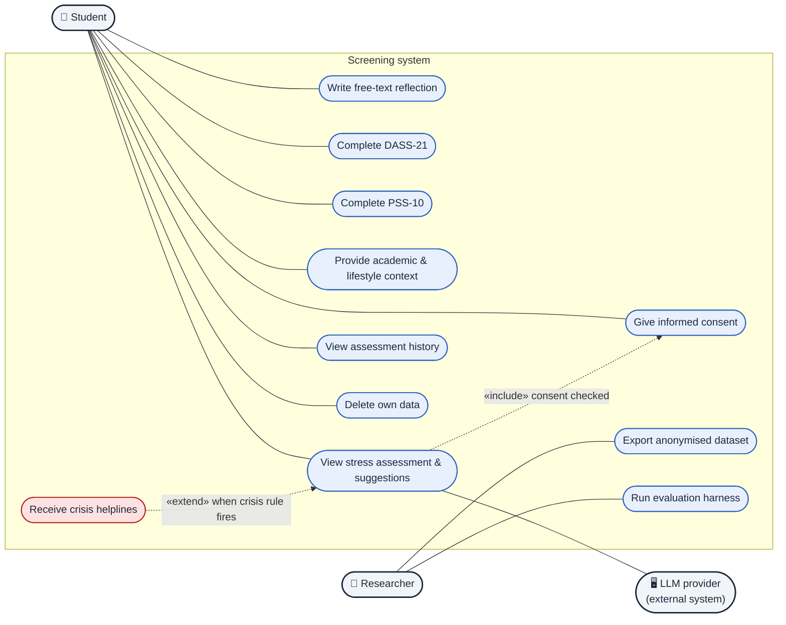

---

## 2 — `diagram_system_overview.png`

Tổng quan cấp cao: input → xử lý → output.

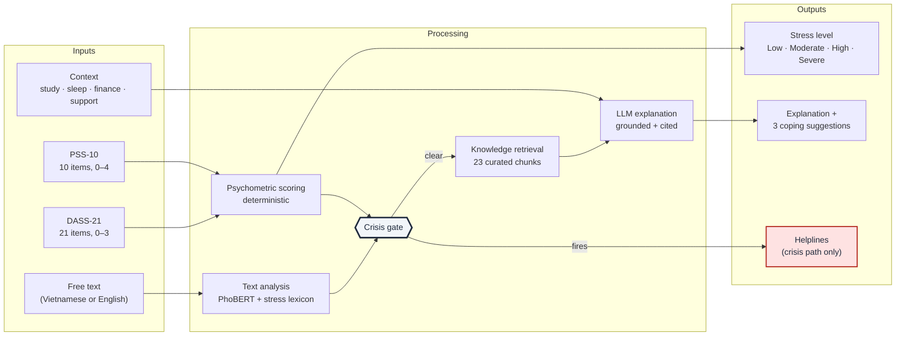

---

## 3 — `diagram_architecture.png`

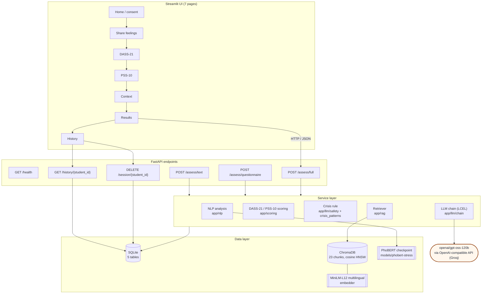

---

## 4 — `diagram_sequence.png`

Thứ tự đúng như code (`run_full_assessment`): phân tích + chấm điểm → crisis gate →
lưu DB → retrieval → LLM.

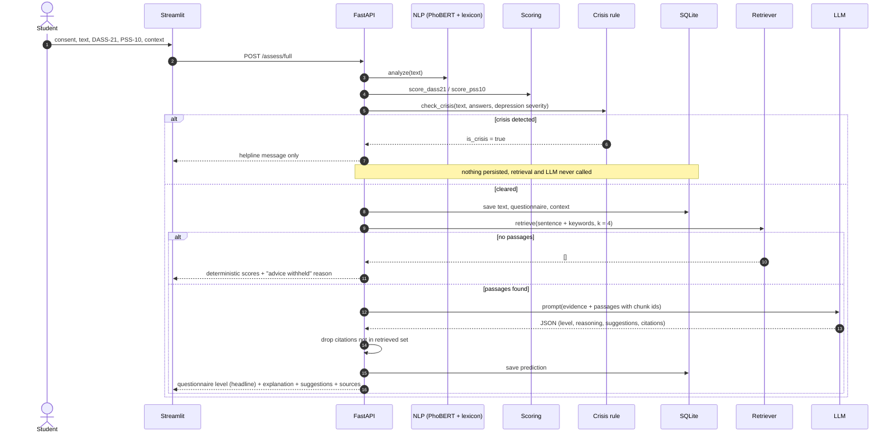

---

## 5 — `diagram_label_fusion.png`

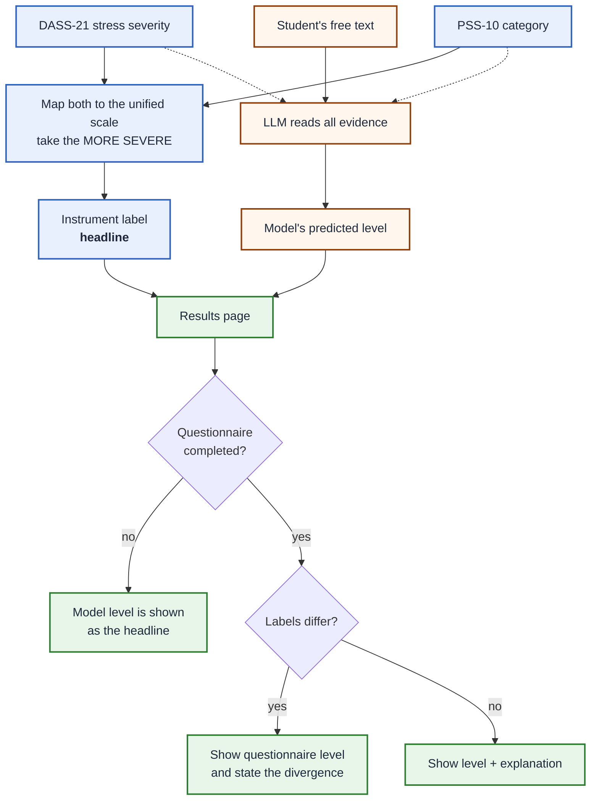

---

## 6 — `diagram_crisis_procedure.png`

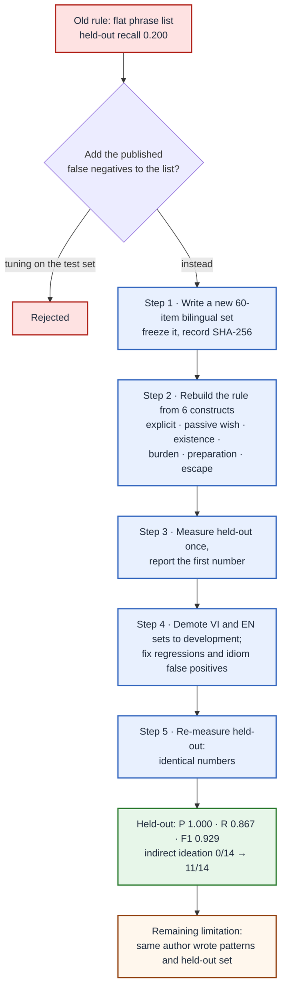

---

## 7 — `diagram_data_pipeline.png`

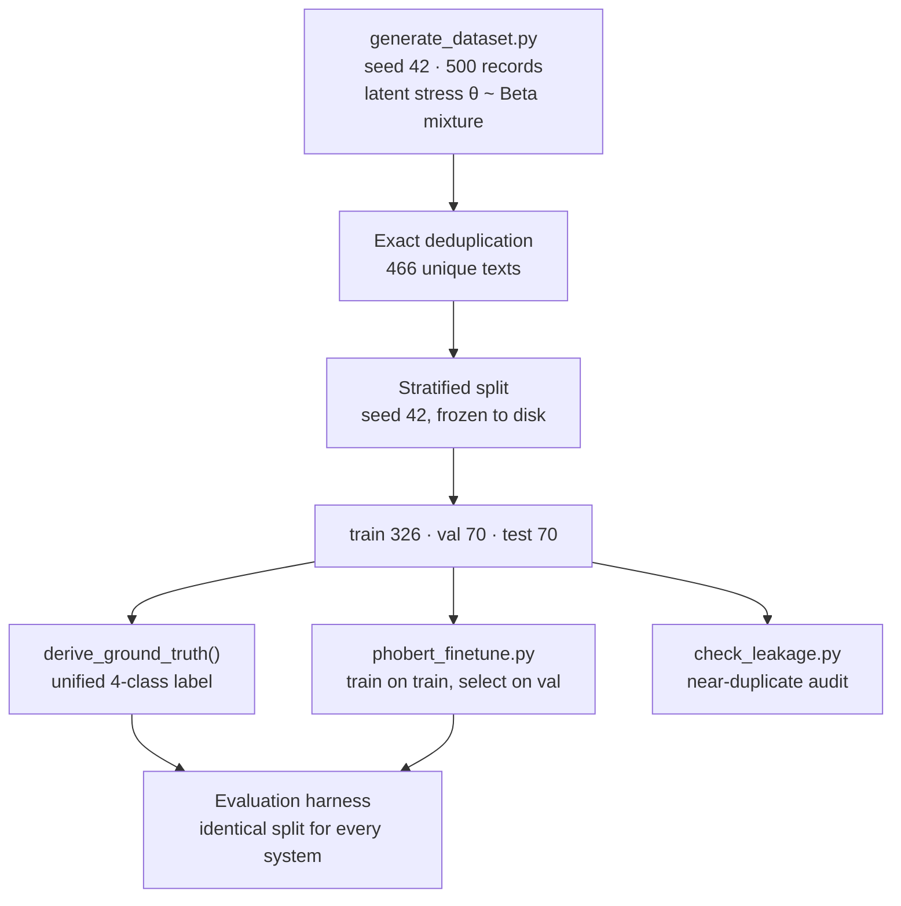

---

## 8 — `diagram_rag_pipeline.png`

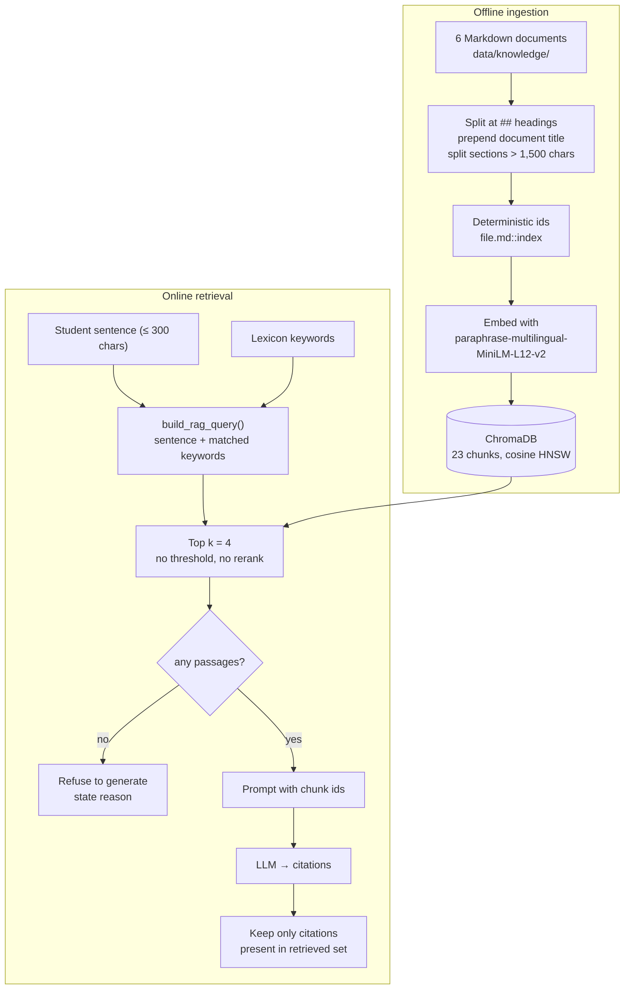

---

## 9 — `diagram_er.png`

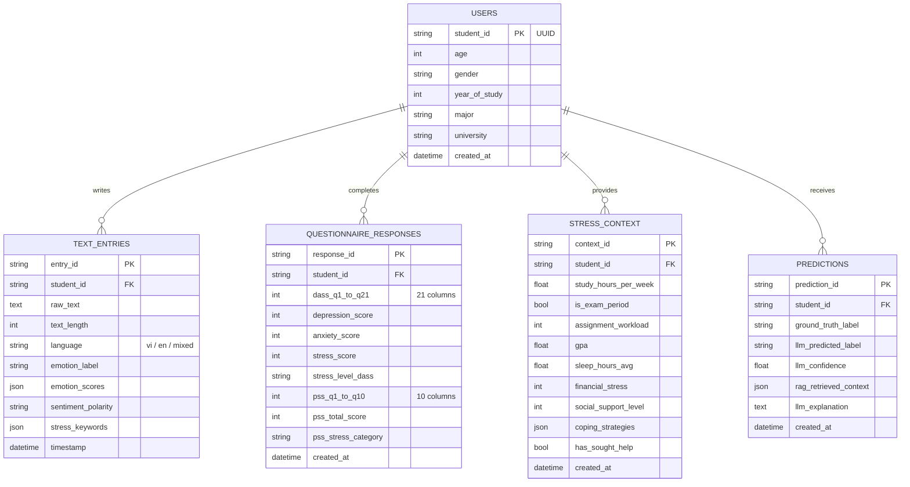

---

## 10 — `diagram_ui_flow.png`

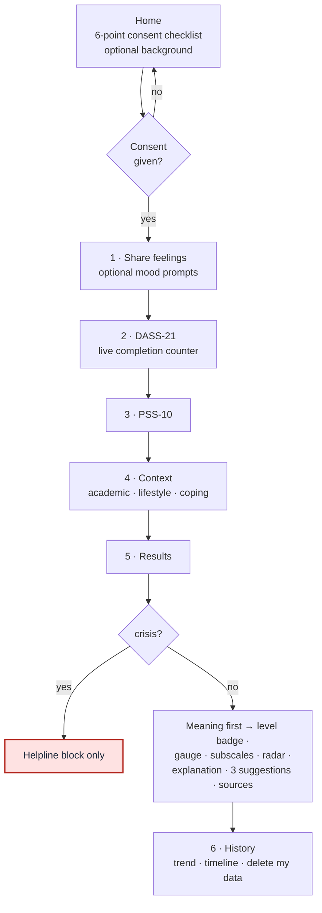

---

## 11 — `diagram_deployment.png`

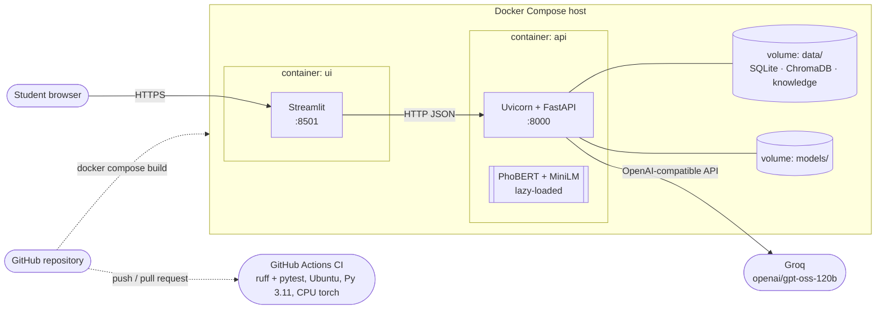

---

## 12 — `diagram_eval_provenance.png`

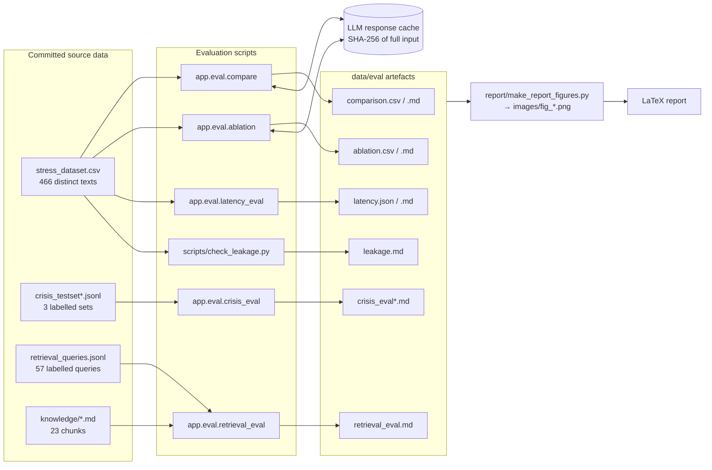
